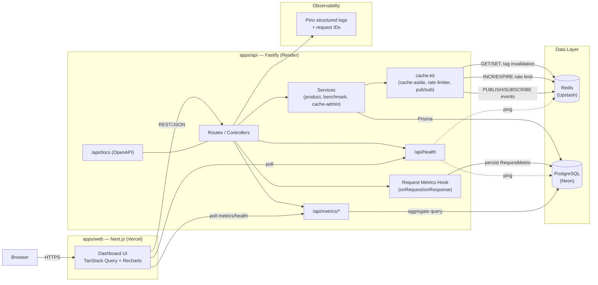
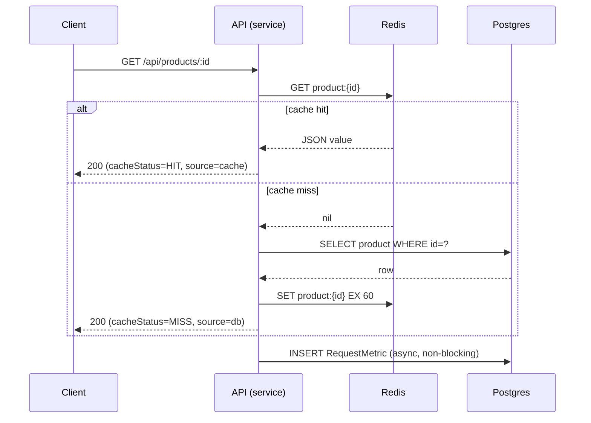

# CacheForge — Project Specification

**"Observe. Cache. Measure. Optimize."**

Status: **Phase 0 — Specification only. No application code has been written.**

This document is the single source of truth for CacheForge. Any implementation decision that contradicts this document should either update this document first, or be treated as a bug.

---

## 0. Environment Detected (Phase 0 inspection)

Inspected on 2026-09-13, working directory `C:\Users\iFocus\Desktop\CacheForge`:

| Tool | Version | Notes |
|---|---|---|
| Node.js | v24.16.0 | Current LTS-class runtime, supports native `fetch`, `Web Streams`, `--env-file` |
| npm | 11.13.0 | Bundled with Node |
| pnpm | **not installed** | `corepack` (0.35.0) **is** available — `corepack enable` will provide the pnpm version pinned in root `package.json#packageManager` without a separate global install |
| Docker | 29.5.3 | Available |
| Docker Compose | v5.1.4 (plugin, `docker compose`) | Available |
| Git | 2.54.0.windows.1 | Available |
| Workspace | `C:\Users\iFocus\Desktop\CacheForge` | **Empty directory**, not a git repository, no existing project files |

**Conclusion:** clean slate. Phase 1 will need to: `git init`, enable corepack/pnpm, and scaffold the monorepo. Nothing here blocks the proposed stack.

---

## 1. Product Vision

CacheForge is a developer-facing platform that makes the *cost of not caching* visible, and the *mechanics of caching correctly* explorable.

Most engineers are told "Redis makes things faster" without ever seeing the number, the failure mode, or the invalidation bug that proves it. CacheForge exists to show, with real measurements against a real Postgres database and a real Redis instance:

- exactly how much latency a cache-aside pattern removes (and under what conditions it doesn't),
- what a cache hit vs. miss actually looks like in the request lifecycle,
- how invalidation, TTL, and stampede-adjacent behavior play out in practice,
- how rate limiting and pub/sub are implemented with Redis outside of "toy CRUD app" contexts,
- and how all of this is observed, tested, containerized, and deployed like a real production system.

The product itself models a small **product catalog API** (read-heavy, a classic caching candidate). The catalog is intentionally simple — it is the *vehicle* for the caching story, not the point of the project. The point is the Performance Lab, the Cache Explorer, and the observability around them.

## 2. Target Users

CacheForge is a **portfolio / demonstration product**, not a commercial SaaS. Its "users" are:

1. **Hiring managers / technical interviewers** evaluating backend, systems, and full-stack skill — they will click around for 5–10 minutes and expect it to look and behave like a real product, not a tutorial repo.
2. **Other engineers** (peer review, GitHub visitors) who want to read the code and docs to judge architecture quality, testing rigor, and decision-making.
3. **The author** — as a reference implementation of caching, benchmarking, and observability patterns to reuse in future real projects (this is why `cache-kit` is designed to be extractable).

Design and documentation decisions throughout this spec optimize for these three audiences, in that order.

## 3. Core User Journeys

| # | Journey | Primary page(s) |
|---|---|---|
| 1 | A visitor lands, understands what the product does in <10s, and picks a path (Dashboard, Performance Lab, Docs) | Landing |
| 2 | A user watches live-ish system metrics: request volume, P50/P95/P99, cache hit rate, recent errors | Overview Dashboard |
| 3 | A user configures and runs a benchmark comparing DB-only vs. Redis-cached access for the same endpoint, and sees real percentile/throughput numbers rendered as charts | Performance Lab |
| 4 | A user browses currently cached keys, inspects a key's value/TTL/type, and manually expires one to observe the next request become a cache miss | Cache Explorer |
| 5 | A user calls any documented API endpoint from the browser (method, path params, body) and sees the live request/response, latency, and cache status | API Explorer |
| 6 | A user checks whether Postgres and Redis are healthy, and sees recent error/latency trends | System Health |
| 7 | A user reads the architecture diagram and understands data flow and technology choices | Architecture |
| 8 | A user reads why decisions were made (ADR-style), not just what was built | Documentation |
| 9 | A user (product owner persona) creates/edits/deletes a product and immediately sees the cache invalidate and the next read become a MISS then HIT | Cache Explorer / API Explorer |

## 4. Functional Requirements

**Catalog domain**
- FR1: CRUD for Product (create, read one, read list w/ pagination + category filter, update, delete).
- FR2: Product reads are cached (cache-aside); writes invalidate affected cache entries.

**Metrics & performance**
- FR3: Every API request is measured (method, route, status, duration, cache status, data source) and persisted.
- FR4: `/api/metrics/summary` exposes aggregate P50/P95/P99, request volume, error rate, cache hit rate over a time window.
- FR5: `/api/metrics/requests` exposes recent individual request records for a live feed/table.
- FR6: A Performance Lab can trigger a controlled benchmark run (DB-only, cache-only, or comparison) against a chosen endpoint with a chosen iteration count, and persist + display the result.

**Cache explorer**
- FR7: List currently active cache keys matching CacheForge's own key namespace (never arbitrary Redis keys), with type, TTL remaining, and approximate size.
- FR8: Inspect a single key's value (safely truncated/pretty-printed).
- FR9: Manually delete (expire) a single key from the UI to demonstrate invalidation.
- FR10: Show live cache stats: hit rate, miss rate, evictions if available, memory usage, connected clients.

**Rate limiting & pub/sub**
- FR11: Rate limit is enforced on write endpoints (and optionally all `/api/*`) using a Redis-backed counter; a rate-limited response is observable in the API Explorer.
- FR12: A Redis Pub/Sub channel emits cache/domain events (e.g., product updated, cache invalidated); the System Health or Cache Explorer page reflects these near-real-time via polling or SSE/WebSocket.

**Platform**
- FR13: `/api/health` reports liveness + readiness (Postgres reachable, Redis reachable).
- FR14: OpenAPI/Swagger docs are generated from the same Zod schemas used for validation, served at `/api/docs`.
- FR15: All pages have defined loading, empty, and error states (no unhandled spinners or blank screens).

## 5. Non-Functional Requirements

| Category | Requirement |
|---|---|
| **Performance** | API p95 < 50ms for cached reads under local benchmark load; cold DB reads are allowed to be slower — the point is the *delta* is real and measured, not a target number to fake. |
| **Reliability** | API must degrade gracefully if Redis is unavailable (serve from Postgres, log a warning, do not 500) and must return a clear 503 from `/api/health` if Postgres is unavailable (Postgres is the source of truth and cannot be bypassed). |
| **Security** | All input validated at the boundary with Zod; no raw Redis command ever reachable from a client-supplied key/value; secrets only via env vars; CORS restricted to known origins; security headers via `@fastify/helmet`. |
| **Accessibility** | WCAG 2.1 AA-oriented: color is never the sole signal (hit/miss/error use icon + text + color), all interactive elements keyboard-reachable, charts have a text/table fallback, contrast ratios checked against the defined palette. |
| **Maintainability** | Strict TypeScript across the monorepo, shared Zod contracts between `apps/api` and `apps/web`, layered backend (routes/services/repositories), no framework logic inside `cache-kit`. |
| **Observability** | Structured JSON logs with request IDs, per-request cache status and latency, `/api/health`, `/api/metrics/*`, and a documented log schema. |
| **Scalability** | Out of scope to actually scale — but architecture must not preclude it: API is stateless (rate-limit and cache state live in Redis, not process memory), Postgres access goes through Prisma with connection pooling, cache-kit is dependency-injected so a second cache backend could be swapped in. |

## 6. Final Architecture



**Cache-aside read path** (referenced throughout this document):



## 7. Monorepo Structure

```
cacheforge/
├── apps/
│   ├── web/                       # Next.js dashboard (deployed to Vercel)
│   │   ├── app/                   # App Router: landing, dashboard, lab, cache, api-explorer, health, architecture, docs
│   │   ├── components/            # shared UI (shadcn/ui-based)
│   │   ├── lib/                   # api client, query hooks, formatting helpers
│   │   └── ...
│   ├── api/                       # Fastify API (deployed to Render)
│   │   ├── src/
│   │   │   ├── routes/            # thin HTTP layer
│   │   │   ├── controllers/       # request/response shaping
│   │   │   ├── services/          # business logic (product, benchmark, cache-admin, metrics)
│   │   │   ├── repositories/      # Prisma queries
│   │   │   ├── plugins/           # fastify plugins: redis, prisma, cors, helmet, rate-limit, swagger, request-id
│   │   │   ├── schemas/           # Zod schemas (request/response), reused for OpenAPI
│   │   │   ├── middleware/        # error handler, metrics hook
│   │   │   └── server.ts
│   │   └── prisma/
│   │       └── schema.prisma
│   └── ...
├── packages/
│   ├── cache-kit/                 # reusable Redis caching library (framework-agnostic)
│   │   ├── src/
│   │   │   ├── cache.ts           # getOrSet, invalidate, tag-based invalidation
│   │   │   ├── rate-limit.ts      # fixed-window limiter
│   │   │   ├── pubsub.ts          # publish/subscribe helpers
│   │   │   └── index.ts
│   │   └── README.md              # standalone usage docs (independent of CacheForge)
│   └── contracts/                 # shared Zod schemas & TS types for API requests/responses
│       └── src/
├── docs/
│   ├── architecture.md
│   ├── caching.md
│   ├── performance.md
│   └── decisions.md
├── .github/
│   └── workflows/
│       └── ci.yml
├── docker-compose.yml
├── .env.example
├── pnpm-workspace.yaml
├── package.json
├── PROJECT_SPEC.md
└── README.md
```

No `packages/ui`, no `packages/config`, no `packages/utils` catch-all — anything that small stays local to the app that needs it. `contracts` exists only because both `apps/api` and `apps/web` would otherwise duplicate request/response types and drift.

## 8. Database Schema (PostgreSQL via Prisma)

Kept to three models — each earns its place: one domain entity, one raw metrics stream, one aggregated benchmark record.

```prisma
model Product {
  id          String    @id @default(cuid())
  sku         String    @unique
  name        String
  description String?
  category    String
  price       Decimal   @db.Decimal(10, 2)
  stock       Int       @default(0)
  createdAt   DateTime  @default(now())
  updatedAt   DateTime  @updatedAt

  @@index([category])
}

model RequestMetric {
  id          BigInt      @id @default(autoincrement())
  requestId   String
  method      String
  route       String
  statusCode  Int
  durationMs  Float
  cacheStatus CacheStatus @default(NOT_APPLICABLE)
  source      DataSource  @default(DB)
  createdAt   DateTime    @default(now())

  @@index([route, createdAt])
  @@index([createdAt])
}

enum CacheStatus {
  HIT
  MISS
  BYPASS
  NOT_APPLICABLE
}

enum DataSource {
  DB
  CACHE
}

model BenchmarkRun {
  id             String        @id @default(cuid())
  label          String?
  targetRoute    String
  mode           BenchmarkMode
  iterations     Int
  concurrency    Int           @default(1)
  minMs          Float
  maxMs          Float
  avgMs          Float
  p50Ms          Float
  p95Ms          Float
  p99Ms          Float
  throughputRps  Float
  cacheHitRate   Float?
  rawLatenciesMs Json
  createdAt      DateTime      @default(now())
}

enum BenchmarkMode {
  DB_ONLY
  CACHE_ONLY
  COMPARISON
}
```

**Relationships:** intentionally none between `Product` and the metrics models. `RequestMetric`/`BenchmarkRun` are observational data about traffic, not domain data about products — joining them by `route` string is sufficient for this project's needs and avoids coupling the metrics pipeline to catalog schema changes.

## 9. Redis Architecture

**Cache strategy:** cache-aside (lazy loading) for all product reads. The API is always correct without Redis (Postgres is the source of truth); Redis is a pure performance layer.

**TTL:** 60s for single-product reads, 30s for list/category queries (lists change more often in relative terms and are cheaper to recompute than a full table scan would suggest at this scale).

**Invalidation:** on any product write (create/update/delete):
1. `DEL product:{id}` for the affected product.
2. Invalidate all cached list queries via a **tag set** rather than `KEYS`/pattern-scanning in the hot path: every list cache write also does `SADD products:list:keys {thatListKey}`; invalidation does `SMEMBERS products:list:keys` → `DEL` each → `DEL products:list:keys`.

This tag-set approach is the one deliberate "clever" piece of the cache design, and it's the reason `KEYS`/`SCAN` never appears on a write path — `SCAN` is used only in the read-only Cache Explorer for admin visibility, which is safe because it's cursor-based and non-blocking.

**Key naming:** `{domain}:{entity}:{qualifier}`, colon-delimited, all lowercase — matches Redis community convention and keeps the Cache Explorer's namespace filter (`cacheforge:*`... actually see table below) trivial to implement with `SCAN MATCH`.

**Rate limiting:** fixed-window counter — `INCR` on `ratelimit:{ip}:{windowStart}` with `EXPIRE` set on first increment. Chosen over a sliding-window/token-bucket for this project because it's the simplest scheme that is still correct and fully explainable in the docs; the trade-off (burst at window boundaries) is documented in §25 rather than hidden.

**Pub/Sub:** a single channel, `cacheforge:events`, carrying JSON messages `{ type: "product.updated" | "product.deleted" | "cache.invalidated", payload, at }`. Used to drive a live event feed on System Health / Cache Explorer without polling for that specific concern.

**Failure behavior:** Redis is optional at runtime.
- Cache read/write errors are caught, logged as warnings, and treated as a miss (fail-open) — the request is served from Postgres.
- Rate-limit errors fail open (request is allowed, warning logged) — availability is prioritized over throttling for a demo system; this trade-off is explicitly called out in §25 as not appropriate for a real abuse-prone production API.
- `/api/health` reports Redis status independently of overall health — Redis being down degrades performance, it does not take the API down.

### Redis Key Table

| Key | Purpose | Type | TTL | Invalidation strategy |
|---|---|---|---|---|
| `cacheforge:product:{id}` | Cached single product payload | String (JSON) | 60s | Deleted on that product's update/delete |
| `cacheforge:products:list:{queryHash}` | Cached paginated/filtered product list | String (JSON) | 30s | Deleted via tag set on any product write |
| `cacheforge:products:list:keys` | Tag set tracking active list-cache keys | Set | none (cleared on invalidation) | Cleared together with the keys it tracks |
| `cacheforge:ratelimit:{ip}:{windowStart}` | Fixed-window request counter | String (INCR) | window length (60s) | Natural TTL expiry |
| `cacheforge:events` | Domain/cache event channel | Pub/Sub (not persisted) | n/a | n/a |

All keys are namespaced under `cacheforge:` so the Cache Explorer can safely `SCAN MATCH cacheforge:*` and never display or touch keys belonging to another application sharing the same Redis instance.

## 10. API Specification

Base path: `/api`. All request/response bodies validated with Zod; the same schemas back the OpenAPI document at `/api/docs`.

### `GET /api/health`
- **Purpose:** liveness + readiness for API, Postgres, Redis.
- **Request:** none.
- **Response 200:** `{ status: "ok" | "degraded", postgres: "up" | "down", redis: "up" | "down", uptimeSec }`
- **Response 503:** when Postgres is down (Redis-down alone yields 200 with `status: "degraded"`).
- **Validation:** none.
- **Caching:** never cached.

### `GET /api/products`
- **Purpose:** paginated, filterable product list.
- **Request (query):** `page?: number=1, pageSize?: number=20 (max 100), category?: string`
- **Response 200:** `{ items: Product[], page, pageSize, total }`
- **Validation:** Zod coerces/validates query params; invalid `page`/`pageSize` → 400.
- **Error cases:** 400 invalid query.
- **Caching:** cache-aside, key `cacheforge:products:list:{hash(page,pageSize,category)}`, TTL 30s, tracked in the list tag set.

### `GET /api/products/:id`
- **Purpose:** fetch one product.
- **Request:** path `id`.
- **Response 200:** `Product`. **404** if not found.
- **Validation:** `id` must be a valid cuid.
- **Caching:** cache-aside, key `cacheforge:product:{id}`, TTL 60s. 404s are **not** cached (avoids masking a just-created product).

### `POST /api/products`
- **Purpose:** create a product.
- **Request (body):** `{ sku, name, description?, category, price, stock? }` (Zod schema, `price` positive decimal).
- **Response 201:** created `Product`.
- **Validation:** required fields enforced; `sku` uniqueness → 409 on conflict.
- **Error cases:** 400 validation, 409 duplicate SKU.
- **Caching:** none for the write itself; invalidates the products list tag set; publishes `product.updated`.

### `PUT /api/products/:id`
- **Purpose:** update a product.
- **Request:** path `id`, body: partial `{ name?, description?, category?, price?, stock? }`.
- **Response 200:** updated `Product`. **404** if not found.
- **Validation:** at least one field required; types validated per field.
- **Caching:** `DEL cacheforge:product:{id}` + invalidate list tag set; publishes `product.updated`.

### `DELETE /api/products/:id`
- **Purpose:** delete a product.
- **Request:** path `id`.
- **Response 204.** **404** if not found.
- **Caching:** `DEL cacheforge:product:{id}` + invalidate list tag set; publishes `product.deleted`.

### `GET /api/metrics/summary`
- **Purpose:** aggregate dashboard metrics over a window.
- **Request (query):** `windowMinutes?: number=15`
- **Response 200:** `{ requestCount, errorRate, p50Ms, p95Ms, p99Ms, cacheHitRate, byRoute: [...] }` computed from `RequestMetric` rows in that window.
- **Caching:** none (must reflect current state); the query itself is indexed and cheap at this data volume.

### `GET /api/metrics/requests`
- **Purpose:** paginated, filterable, searchable request log for a live feed/table (the Overview Dashboard's Recent Requests table) and for the Recent-latency-by-cache-status chart's unfiltered "most recent N" sample.
- **Request (query):** `page?: number=1, pageSize?: number=50 (max 200), windowMinutes?: number, route?: string, search?: string (substring of route, case-insensitive), method?: GET|POST|PUT|PATCH|DELETE, cacheStatus?: HIT|MISS|BYPASS|NOT_APPLICABLE, statusClass?: 2xx|4xx|5xx, source?: DB|CACHE, requestId?: string`
- **Response 200:** `{ items: RequestMetric[], page, pageSize, total }`, newest first (same pagination envelope as `GET /api/products`); ties broken by `id DESC` for deterministic paging.
- **Caching:** none (must reflect current state). `search`/`statusClass` are sequential scans under whatever other filters narrow the row set first — no `pg_trgm`/index added for this at current data volume; revisit if the table grows large enough for it to matter.

### `POST /api/benchmarks/run`
- **Purpose:** execute a controlled benchmark and persist the result (see §11).
- **Request (body):** `{ targetRoute: "products.list" | "products.get", mode: "DB_ONLY" | "CACHE_ONLY" | "COMPARISON", iterations: number (1–1000), concurrency?: number=1 (1–20), label?: string }`
- **Response 201:** `BenchmarkRun` (for `COMPARISON`, response includes both sub-results).
- **Validation:** iteration/concurrency bounds enforced to prevent accidental self-DoS.
- **Error cases:** 400 out-of-range params; 503 if `mode` requires Redis and Redis is down.
- **Caching:** not applicable — this endpoint's entire job is to *bypass* normal caching rules under controlled conditions.

### `GET /api/benchmarks` / `GET /api/benchmarks/:id`
- **Purpose:** list/retrieve past benchmark runs for the Performance Lab's history view.
- **Response 200:** `BenchmarkRun[]` / `BenchmarkRun`.

### `GET /api/cache/keys`
- **Purpose:** list active CacheForge-namespaced keys for the Cache Explorer.
- **Request (query):** `pattern?: string` (must match `cacheforge:*`, further constrained server-side), `cursor?: string`
- **Response 200:** `{ keys: [{ key, type, ttlSeconds }], nextCursor }` via non-blocking `SCAN`.
- **Caching:** none (live view).

### `GET /api/cache/stats`
- **Purpose:** Redis-level stats for dashboard (`INFO` subset): hit rate, memory, connected clients, uptime.
- **Response 200:** `{ hits, misses, hitRate, usedMemoryHuman, connectedClients, uptimeSec }`.

### `DELETE /api/cache/:key`
- **Purpose:** manually expire a single cache key (demonstrates invalidation live).
- **Request:** path `key`, url-encoded.
- **Validation:** key **must** start with `cacheforge:` or 400 — this endpoint can never touch a key outside CacheForge's own namespace.
- **Response 204.** **404** if key didn't exist.

### `GET /api/docs`
- **Purpose:** OpenAPI/Swagger UI generated from the Zod schemas above via `@fastify/swagger` + `@fastify/swagger-ui`.

## 11. Performance Lab Design

The Performance Lab produces **real, locally reproducible measurements** — nothing here is simulated or pre-baked.

**Execution model:** a benchmark run executes entirely **inside the API process**, calling the same service-layer functions the real routes use (not looping HTTP requests over the network, which would measure the network/proxy more than the cache). Concretely:

- `DB_ONLY` mode calls the product repository directly, bypassing `cache-kit` entirely, for `iterations` calls.
- `CACHE_ONLY` mode calls the normal cached service path (cache-aside as used by the real route) for `iterations` calls — the first call(s) will legitimately show a MISS, the rest should show HIT unless TTL is exceeded mid-run.
- `COMPARISON` mode runs `DB_ONLY` immediately followed by `CACHE_ONLY` (same target, same data) and returns both result sets side by side.

**Concurrency:** default 1 (strictly sequential, cleanest signal); optional up to 20 concurrent in-flight calls via a small worker pool, to additionally demonstrate throughput under load. Concurrency is capped server-side to prevent someone (accidentally or otherwise) turning the "benchmark" button into a denial-of-service tool against their own instance.

**Latency measurement:** each iteration is timed with `process.hrtime.bigint()` immediately around the repository/service call (excludes HTTP parsing overhead of the *outer* `/api/benchmarks/run` request, which is irrelevant to what's being measured). All raw per-iteration durations (ms) are kept for the run.

**Percentiles:** computed from the sorted array of raw latencies using the **nearest-rank method**: for percentile `p`, index = `ceil(p/100 * n) - 1`. This is documented explicitly in `docs/performance.md` so the numbers are reproducible and auditable, not a black box.

**Throughput:** `iterations / totalWallClockSeconds`, measured across the whole run (including concurrency), reported as requests/sec.

**Cache hit rate (for `CACHE_ONLY`/`COMPARISON`):** tracked by counting how many of the iterations resolved from Redis vs. Postgres, exposed as `hits / iterations`.

**Persistence:** every run (and its raw latency array, for later histogram rendering) is saved as a `BenchmarkRun` row so the Performance Lab has a history view, not just a single ephemeral result.

**Guardrails:** `iterations` capped at 1000 and `concurrency` at 20 per run; the endpoint itself is subject to the same Redis-backed rate limiter as any other write-ish endpoint, so it can't be hammered from the UI.

## 12. Frontend Information Architecture

| Page | Purpose | Main components | Data required | Key interactions | Loading | Empty | Error |
|---|---|---|---|---|---|---|---|
| **Landing** | Explain the product in <10s, route to Dashboard/Lab/Docs | Hero, 3-step "how it works" (Postgres → Redis → Fastify), CTA buttons | none (static) | CTA nav | n/a | n/a | n/a |
| **Overview Dashboard** | At-a-glance system + traffic health | Stat tiles (P50/P95/P99, req/min, cache hit rate, error rate), request-rate sparkline, recent-requests table | `GET /api/metrics/summary`, `GET /api/metrics/requests` (polled) | Change time window (15m/1h/24h) | Skeleton tiles + skeleton table | "No traffic yet — try the API Explorer" with CTA | Inline banner + retry; stale data kept visible with a "last updated" timestamp |
| **Performance Lab** | Run and visualize DB vs. cache benchmarks | Run config form (route, mode, iterations, concurrency), live progress indicator, result cards (P50/P95/P99, throughput, hit rate), comparison bar chart, run history table | `POST /api/benchmarks/run`, `GET /api/benchmarks` | Submit run, select past run to view, compare two runs | Progress bar / spinner tied to real run duration (no fake timers) | "Run your first benchmark" empty state | Form validation errors inline; run failure shown as a dismissible error card, does not lose form state |
| **Cache Explorer** | Inspect and manipulate live cache state | Key list (virtualized), key detail drawer (value, type, TTL), stats panel (hit rate, memory, clients), delete-key action with confirm | `GET /api/cache/keys`, `GET /api/cache/stats` (polled), `DELETE /api/cache/:key` | Search/filter keys, open detail, delete key, "watch" a key's TTL count down | Skeleton list | "No cache entries — trigger a product read to populate the cache" with CTA | If Redis unreachable: explicit "Redis unavailable" state (distinct from empty), API keeps functioning |
| **API Explorer** | Try any endpoint from the browser | Endpoint picker (grouped by resource), param/body form generated from the Zod/OpenAPI schema, response viewer (status, headers incl. cache status, body, latency) | `GET /api/docs` (OpenAPI JSON) to drive the form; then the live endpoint itself | Fill form, send request, view formatted response, copy as curl | Button shows in-flight spinner | n/a (always has endpoints to show) | Response viewer renders the actual error status/body returned, not swallowed |
| **System Health** | Infra status + recent errors + live event feed | Health cards (API/Postgres/Redis), error-rate trend, live `cacheforge:events` feed | `GET /api/health` (polled), `GET /api/metrics/summary`, pub/sub feed (SSE or short-poll) | Manual "recheck now" | Skeleton cards | "No recent errors" positive empty state | Down-service card turns red/amber with last-checked time, not a page-level crash |
| **Architecture** | Explain the system design | This spec's Mermaid diagram (rendered), stack table, links to `docs/*.md` | Static content from `docs/architecture.md` | none beyond scrolling | n/a | n/a | n/a |
| **Documentation** | Deep technical explanation | Rendered `docs/caching.md`, `docs/performance.md`, `docs/decisions.md` | Static markdown | in-page nav / TOC | n/a | n/a | n/a |

Data fetching throughout uses **TanStack Query** (polling intervals: 5s for dashboard/health, none for on-demand pages) so loading/error/stale states are consistent and don't need bespoke state machines per page.

## 13. UI/UX Direction

CacheForge should read as a **focused instrument**, not a generic admin panel — closer in spirit to Vercel's or Linear's dashboards than to a Bootstrap admin theme.

- **Typography:** Geist (or Inter as fallback) for UI text; **Geist Mono / JetBrains Mono** for anything numeric or code-like — latencies, keys, JSON, status codes. Numbers are always tabular-figure/monospace so columns of metrics align visually.
- **Spacing:** 4px base unit, 8px rhythm for most component padding/gaps; generous whitespace over dense packing — a handful of well-chosen stat tiles beats a wall of tiny ones.
- **Color system:** dark-mode-first, near-black neutral background (`#0A0A0B`-class), a single accent color used sparingly for primary actions/links (not Redis-red everywhere — that reads as a theme demo, not a product), and strict semantic colors reused consistently: green = cache HIT / healthy, amber = MISS / degraded, red = error/down, neutral gray = bypass/n/a. Color is never the only signal — every status also has an icon and a text label.
- **Component principles:** shadcn/ui as the primitive layer (Button, Card, Table, Sheet/Drawer, Tabs, Badge) styled to the above tokens; every chart uses Recharts and displays **only data that's actually computed** — no decorative or placeholder charts ship to "fill space."
- **Motion:** minimal — state transitions (skeleton → content, hit/miss badge appearing) use short (~150ms) opacity/scale transitions only; no scroll-jacking, no gratuitous entrance animations.
- **Responsive behavior:** dashboard/lab/cache pages are usable down to ~768px (tables become horizontally scrollable within their card, stat tiles reflow to 2-column then 1-column); below that, the product communicates it's optimized for desktop use (this is a developer tool, not a consumer mobile app) but remains readable.
- **Accessibility:** all interactive elements keyboard-operable and focus-visible; charts paired with an accessible data table (visually hidden or in a "view as table" toggle); status badges carry `aria-label`s beyond color; minimum 4.5:1 contrast for body text against the dark background, checked against the actual token values once defined in code (not assumed).

## 14. Backend Architecture

Layering, strictly one-directional (routes → controllers → services → repositories):

- **Routes:** Fastify route definitions only — path, method, schema (Zod→JSON Schema) attachment, and which controller handler to call. No business logic.
- **Controllers:** translate HTTP (params/query/body) into service calls, and service results into HTTP responses/status codes. No Prisma or Redis calls here.
- **Services:** business logic — e.g. `productService.getById(id)` implements the cache-aside decision (check cache → fall back to repository → populate cache), `benchmarkService.run(...)` implements §11. Services depend on `cache-kit` and repositories via constructor/factory injection, never on Fastify's `request`/`reply`.
- **Repositories:** the only layer that talks to Prisma. Thin, query-shaped functions (`findById`, `list`, `create`, `update`, `delete`) — no caching awareness at all.
- **Plugins:** Fastify plugins register cross-cutting infra as decorators: `prismaPlugin`, `redisPlugin` (wraps `cache-kit`'s cache/rate-limit/pubsub instances), `corsPlugin`, `helmetPlugin`, `rateLimitPlugin` (uses `cache-kit`'s limiter), `swaggerPlugin`, `requestIdPlugin`.
- **Schemas:** Zod schemas per resource (`productCreateSchema`, `productSchema`, etc.) live in `packages/contracts` so `apps/web` can import the same types for its API client — one definition of "what a Product looks like over the wire."
- **Middleware:** a global error handler (maps known error types → status codes, everything else → 500 with a logged stack trace and a generic body) and an `onRequest`/`onResponse` hook pair that times every request and writes a `RequestMetric` row asynchronously (never blocking the response).

## 15. Testing Strategy

| Layer | Tool | Scope |
|---|---|---|
| Unit | Vitest | `cache-kit` (getOrSet hit/miss/error paths, tag invalidation, rate limiter window math), services (business logic with repositories/cache mocked), percentile calculation |
| Integration | Vitest + Fastify `.inject()` | Full route behavior against **real** Postgres + Redis (docker-compose test services): CRUD correctness, cache header/status correctness, error mapping |
| E2E | Playwright | Critical dashboard flows: load Overview Dashboard and see real data, run a small benchmark end-to-end in the Performance Lab, delete a key in the Cache Explorer and see it disappear |
| Load | k6 | Rate limiter behavior under burst traffic; baseline throughput sanity check for `/api/products` cached vs. uncached |

**Scenarios that must be explicitly covered (integration level unless noted):**
- Cache hit returns `cacheStatus: HIT` and does not touch Postgres (assert via a repository spy).
- Cache miss returns `cacheStatus: MISS`, populates the cache, and a subsequent identical request is a HIT.
- TTL expiry: after TTL elapses (test uses a short TTL override), the next request is a MISS again.
- Invalidation: updating/deleting a product results in the next read being a MISS.
- Redis unavailable (integration test stops the Redis container or points at a bad connection): reads still succeed (fail-open), served from Postgres, with a logged warning.
- Postgres unavailable: `/api/health` returns 503; product routes return a clear 5xx rather than hanging.
- Rate limiting: N+1th request within a window is rejected with 429 and a `Retry-After` header (unit test for the window math, integration test for the actual header).
- Invalid input: Zod validation failures return 400 with a field-level error body, for every write endpoint.
- API errors: 404 on unknown product id, 409 on duplicate SKU.

## 16. Docker Architecture

Local development is `docker compose up`, four services:

```yaml
services:
  postgres:
    image: postgres:16-alpine
    environment: [POSTGRES_USER, POSTGRES_PASSWORD, POSTGRES_DB]
    ports: ["5432:5432"]
    healthcheck: pg_isready
    volumes: [pgdata:/var/lib/postgresql/data]

  redis:
    image: redis:7-alpine
    ports: ["6379:6379"]
    healthcheck: redis-cli ping

  api:
    build: ./apps/api
    env_file: .env
    environment: [DATABASE_URL=postgres://...@postgres:5432/..., REDIS_URL=redis://redis:6379]
    depends_on:
      postgres: { condition: service_healthy }
      redis: { condition: service_healthy }
    ports: ["4000:4000"]

  web:
    build: ./apps/web
    environment: [NEXT_PUBLIC_API_URL=http://localhost:4000]
    depends_on: [api]
    ports: ["3000:3000"]
```

**Networking:** default compose bridge network; services address each other by service name (`postgres`, `redis`, `api`) internally, while the host reaches them via the mapped ports above. **Environment variables** are supplied via a root `.env` (git-ignored) with `.env.example` committed as the template; `apps/web` only ever receives the `NEXT_PUBLIC_*`-prefixed subset it's allowed to see in the browser bundle.

## 17. CI/CD Architecture (GitHub Actions)

Single workflow, staged so a failure short-circuits early and cheaply:

```
install (pnpm, cached)
  → lint (eslint across all workspaces)
  → typecheck (tsc --noEmit across all workspaces)
  → unit tests (vitest, no external services)
  → integration tests (vitest, against postgres+redis GitHub Actions service containers)
  → build (next build, tsc build for api and packages)
  → e2e (playwright, against the built app + compose services) — runs on PRs to main only, to keep per-commit CI fast
```

Each stage is a separate job (not steps in one job) so failures are attributable at a glance in the PR checks list; `unit`/`typecheck`/`lint` run in parallel after `install`, `integration` waits on service containers being healthy, `build` waits on typecheck+unit, `e2e` waits on build.

## 18. Production Deployment

| Component | Provider | Notes |
|---|---|---|
| Frontend (`apps/web`) | **Vercel** | `NEXT_PUBLIC_API_URL` points at the Render API's public URL; standard Next.js build, no special config beyond monorepo root detection |
| API (`apps/api`) | **Render** | Docker or native Node web service; env vars `DATABASE_URL`, `REDIS_URL`, `CORS_ORIGIN` (set to the Vercel URL), `NODE_ENV=production` |
| PostgreSQL | **Neon** | Serverless Postgres, `DATABASE_URL` includes `sslmode=require`; Prisma migrations run as a Render deploy hook or manual `prisma migrate deploy` step |
| Redis | **Upstash** | `REDIS_URL`/`REDIS_TOKEN` (TLS); `cache-kit` is configured to tolerate the higher latency of a serverless Redis vs. local Docker Redis — this is itself an interesting, honestly-reported data point in the Performance Lab, not something to hide |

**Service communication:** browser → Vercel (Next.js) → Render (Fastify) over HTTPS/CORS (Render API's `CORS_ORIGIN` allowlist = the Vercel deployment URL(s) only); Render API → Neon and Upstash over their respective TLS connection strings, never exposed to the browser.

## 19. Security Architecture

- **Validation:** every request boundary (params/query/body) validated with Zod before touching any service — no implicit trust of client input anywhere.
- **Rate limiting:** Redis-backed fixed-window limiter (see §9) applied to all `/api/*` routes, tighter limits on write routes and `/api/benchmarks/run`.
- **CORS:** explicit origin allowlist (`CORS_ORIGIN` env var), credentials not used (no cookies — this is a token-free demo API), so a permissive wildcard is never needed.
- **Security headers:** `@fastify/helmet` for standard headers (CSP tuned to allow the dashboard's own assets, `X-Content-Type-Options`, `X-Frame-Options`, etc.).
- **Secrets:** only via environment variables (`.env`, git-ignored; provider secret managers in prod); never logged, never included in error responses.
- **Logging:** structured logs never include request bodies verbatim for write endpoints with potentially sensitive-shaped fields (defensive default, even though this domain has no real PII) — only IDs, routes, statuses, durations.
- **Redis command restrictions:** the application never issues `FLUSHALL`/`FLUSHDB`/`KEYS` in any code path. Only `SCAN` (cursor-based) is used for enumeration, and only ever `MATCH`ed against the `cacheforge:*` namespace. The `DELETE /api/cache/:key` endpoint rejects (400) any key not prefixed `cacheforge:`. In production, the Redis credential used should be scoped (Upstash supports read/write-restricted tokens) to further prevent any accidental cross-tenant blast radius.
- **API safety:** no endpoint ever executes an arbitrary Redis command or SQL string supplied by a client; the Cache Explorer and API Explorer are both curated UIs over a fixed, validated set of operations, not consoles.

## 20. Observability

- **Structured logs:** Pino, JSON in production (pretty-printed in dev), one line per request with `{ requestId, method, route, statusCode, durationMs, cacheStatus }` plus any warnings (e.g., "Redis unavailable, served from DB").
- **Request IDs:** generated (or propagated from an incoming `x-request-id` header) per request via a Fastify plugin, attached to the logger context and returned in the response header, so a single request can be traced end-to-end through logs and, if needed, correlated with its `RequestMetric` row.
- **Latency & cache status:** captured for every request via the metrics hook described in §14, both logged and persisted.
- **Errors:** the global error handler logs full error detail server-side while returning a sanitized message to the client; error rate is part of `/api/metrics/summary`.
- **Health checks:** `/api/health` actively pings Postgres (`SELECT 1`) and Redis (`PING`) rather than assuming connection-pool state reflects reality.
- **Metrics:** `/api/metrics/summary` and `/api/metrics/requests` (§10) are CacheForge's own metrics surface; no external APM is introduced, since building and displaying this pipeline *is* the point of the project.

## 21. `packages/cache-kit` — NPM Package Strategy

`cache-kit` is designed from day one to be usable **outside** CacheForge, even though it will not be published during this project:

- **Framework-agnostic:** depends only on a `node-redis` client instance passed in by the caller (constructor injection) — no Fastify, no Express, no knowledge of HTTP at all.
- **Small, composable surface:**
  - `createCache(redisClient, { defaultTtlSeconds }) → { getOrSet(key, ttlSeconds, fetcher, tags?), invalidate(key), invalidateTag(tag) }`
  - `createRateLimiter(redisClient, { windowSeconds, max }) → { consume(identifier) → { allowed, remaining, resetAt } }`
  - `createPubSub(redisClient) → { publish(channel, message), subscribe(channel, handler) }`
- **No hidden global state:** every function takes its dependencies explicitly; two independent `createCache()` instances against two different Redis clients never interfere with each other — this is what makes it safe to unit test in isolation and safe to reuse in an unrelated project.
- **Own test suite and README**, versioned independently inside the pnpm workspace (`workspace:*` reference from `apps/api` during this project); the README is written as if a stranger is adopting the package, not as CacheForge-specific documentation.
- **Publishing:** deliberately deferred. The package is structured (package.json `exports`, `files`, semver-ready) so that `pnpm publish` from `packages/cache-kit` would work with no further changes, once there's a decision to actually do so — but that decision and its versioning/support implications are explicitly out of scope for this two-day project.

## 22. Documentation Strategy

| File | Contents |
|---|---|
| `README.md` | What CacheForge is, screenshot/GIF, quickstart (`docker compose up`, env setup), link to the deployed instance, link to `docs/` |
| `docs/architecture.md` | The §6 diagram plus prose walkthrough of each layer and why it exists |
| `docs/caching.md` | The §9 key table, the cache-aside sequence diagram, invalidation strategy, and the honest failure-mode discussion |
| `docs/performance.md` | The §11 methodology (how percentiles are computed, how runs are executed) plus real benchmark numbers once they exist — **numbers are added only after they are actually measured**, never placeholders |
| `docs/decisions.md` | ADR-style log: Context / Decision / Reason / Trade-off for each major choice in §25, so the "why" survives independently of this spec |

## 23. Git Strategy

- **Commit convention:** Conventional Commits — `feat:`, `fix:`, `docs:`, `refactor:`, `test:`, `perf:`, `chore:`, `ci:` — scoped where useful (`feat(api): add product cache invalidation`).
- **Branching:** trunk-based with short-lived feature branches (`feat/cache-explorer`, `fix/rate-limit-window`); given the two-day solo timeline, branches map roughly to the phases in §24 rather than to individual tickets.
- **Commit size:** one logical change per commit (e.g., "add Product Prisma model + migration" separate from "add product repository") so history itself documents the build order — useful for the "read the code" audience from §2.

## 24. Two-Day Implementation Plan

**Day 1 — Backend, data, caching core**
- MUST: monorepo scaffold (pnpm workspaces, tsconfig base), Docker Compose (postgres, redis), Prisma schema + migration, `cache-kit` (cache-aside + rate limiter), Fastify app skeleton with plugins/error handler/request-id, Product CRUD routes with cache-aside wired in, `/api/health`, metrics hook + `RequestMetric` persistence, `/api/metrics/summary` & `/requests`, unit tests for `cache-kit`, integration tests for Product CRUD + cache hit/miss/invalidation.
- SHOULD: `/api/benchmarks/run` + percentile calc, Pub/Sub events, OpenAPI/Swagger doc generation.
- NICE: k6 load test script, rate-limit integration test for the 429/Retry-After path.

**Day 2 — Frontend, polish, deploy**
- MUST: Next.js app shell + Tailwind/shadcn setup, Overview Dashboard (real data), Performance Lab (run + view a benchmark end-to-end), Cache Explorer (list/inspect/delete a key), API Explorer (at least Product endpoints), Landing page, README + `docs/architecture.md` + `docs/caching.md`.
- SHOULD: System Health page with live event feed, `docs/performance.md` with real numbers, GitHub Actions CI (lint/typecheck/unit/integration/build), deploy to Vercel + Render + Neon + Upstash.
- NICE: Playwright E2E for the three critical flows, `docs/decisions.md`, dark/light theme toggle, Architecture page rendering this spec's diagram live rather than as a static image.

If time runs out, **cut from the bottom of each NICE list first, then SHOULD** — never ship a MUST-have half-finished in place of a polished smaller scope.

## 25. Risks and Trade-offs

| Decision | Context | Reason | Trade-off |
|---|---|---|---|
| Fail-open on Redis errors (cache + rate limit) | Redis is a demo-project dependency more likely to hiccup (serverless cold starts on Upstash) than Postgres | Keeps the product usable and honest about degrade-gracefully behavior, which is itself a thing worth demonstrating | A real, abuse-exposed production API should fail rate-limiting *closed* or use a local in-memory fallback limiter — documented here as a known, deliberate simplification |
| Fixed-window rate limiting over sliding-window/token-bucket | Two-day budget; fixed-window is simplest to implement, test, and explain correctly | Correctness and clarity over sophistication | Allows up to 2x burst at window boundaries — acceptable for a demo, called out explicitly rather than glossed over |
| Benchmarks run in-process rather than over real HTTP | Measuring the network/proxy hop would conflate "how fast is my WiFi" with "how much does the cache help" | Isolates the variable actually being demonstrated | The Performance Lab numbers are not literal end-to-end client latency; `docs/performance.md` must state this plainly so the numbers are never misread as marketing claims |
| No auth/login system | Product is a single-operator demo instance, not multi-tenant SaaS | Removes a large surface (sessions, users, permissions) that adds no demonstration value here | Destructive actions (delete key, delete product) are protected only by rate limiting + namespace restrictions, not per-user authorization — acceptable for a portfolio deploy, would not be acceptable if this ever took real traffic |
| Only 3 Postgres models | Two-day scope; every additional model is additional migrations, seed data, and UI to justify | Keeps the schema honestly simple, matching the instruction to avoid over-engineering | Reviewers looking for "complex relational modeling" won't find it here — acceptable, because that isn't what this project is demonstrating |
| `contracts` package instead of duplicating types | `apps/api` and `apps/web` both need Product/metrics shapes | Avoids silent drift between backend validation and frontend types | One more workspace package to keep in sync during scaffolding — small, one-time cost |
| Playwright/k6/full CI E2E marked SHOULD/NICE, not MUST | Two-day timeline; these are the most time-variable pieces (flakiness, environment setup) | Protects the MUST-have core (working cache demonstration) from being rushed to make room for test infra polish | If cut, the "testing strategy" section describes intent more than delivered coverage — must be stated honestly in the final README, never implied as done |

## 26. Definition of Done

- [ ] **Backend:** Product CRUD implemented and layered per §14; input validated at every write boundary; global error handler maps errors to correct status codes.
- [ ] **Redis:** cache-aside working for product get/list with correct TTLs; tag-based list invalidation verified; rate limiter enforced and returns 429 + `Retry-After`; pub/sub events published on writes; fail-open behavior verified when Redis is stopped.
- [ ] **Database:** Prisma schema migrated; `Product`, `RequestMetric`, `BenchmarkRun` all populated by real traffic, not seed-only fixtures (seed data allowed for initial demo content, but the metrics tables must reflect actual requests).
- [ ] **Frontend:** all eight pages in §12 implemented with defined loading/empty/error states; no page shows fabricated numbers.
- [ ] **Testing:** unit tests for `cache-kit` and percentile math pass; integration tests cover every scenario in §15; at minimum the three critical Playwright flows pass if E2E was in scope for the final cut.
- [ ] **Security:** Zod validation on every input; CORS allowlist configured for the deployed origin; `@fastify/helmet` enabled; no `KEYS`/`FLUSHALL` anywhere in the codebase (grep-checked); `/api/cache/:key` namespace guard verified with a test.
- [ ] **Docker:** `docker compose up` brings up a fully working local stack from a clean clone with only `.env` populated from `.env.example`.
- [ ] **CI/CD:** GitHub Actions pipeline green on `main` for lint/typecheck/unit/integration/build at minimum.
- [ ] **Deployment:** live URLs for `apps/web` (Vercel) and `apps/api` (Render), backed by Neon and Upstash, reachable and functioning end-to-end.
- [ ] **Documentation:** README quickstart verified by following it on a clean checkout; `docs/architecture.md`, `docs/caching.md` complete; `docs/performance.md` contains real measured numbers (not placeholders) if the Performance Lab shipped.
- [ ] **Performance:** at least one real, reproducible DB-vs-cache comparison exists and is explainable end-to-end (what was measured, how, and why the result looks the way it does).
- [ ] **UX:** dashboard is usable at both desktop and ~768px widths; every status indicator pairs color with an icon/label; no unhandled loading state left as a bare spinner with no timeout/error path.
