# CacheForge — Architecture Diagrams

Companion to `docs/TECHNICAL_ARCHITECTURE.md`. Every diagram here matches
the implementation as of this audit — file/function citations are in the
main document; this file is diagrams only. Rendered with Mermaid where
practical (GitHub and most editors render these natively).

---

## 1. High-level architecture

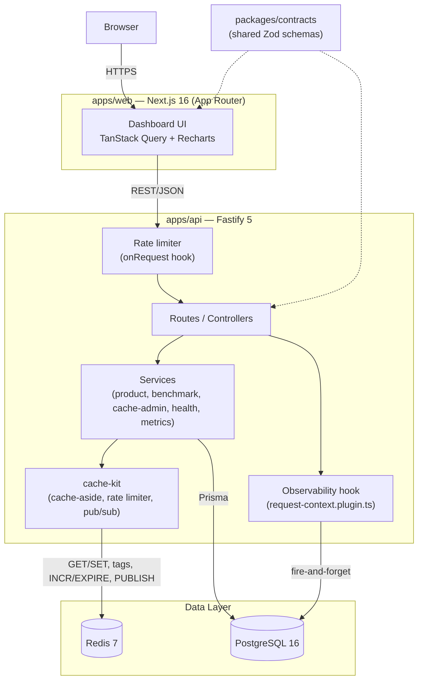

## 2. Frontend architecture

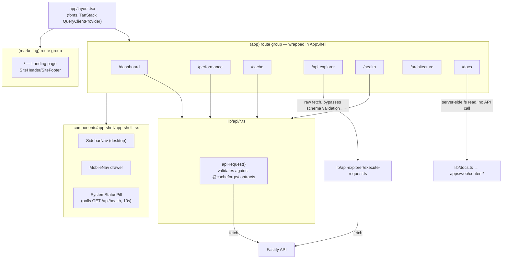

## 3. Backend architecture (layering)

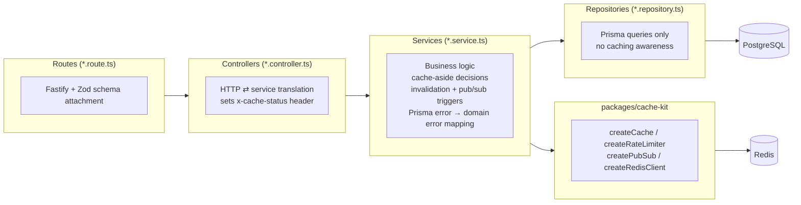

## 4. Product read flow (`GET /api/products/:id`)

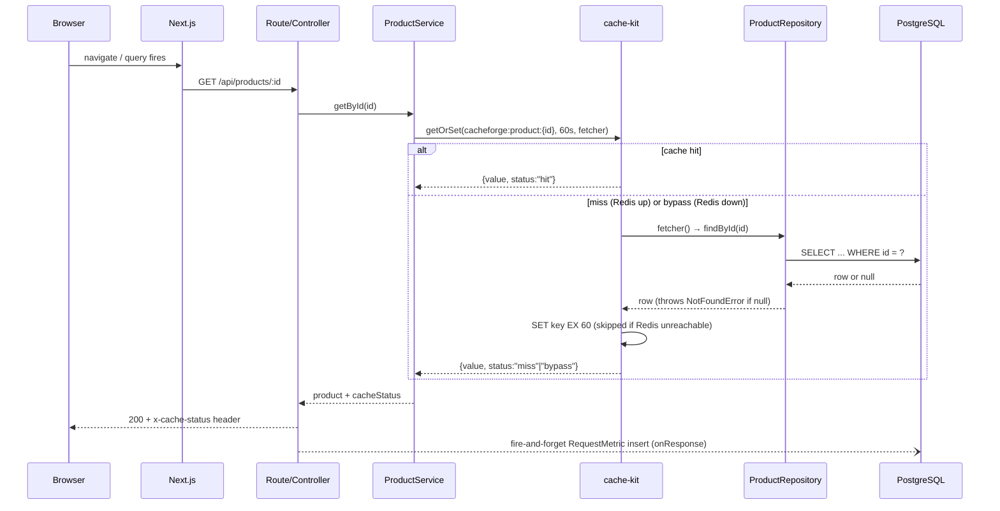

## 5. Product write flow (`POST` / `PUT` / `DELETE`)

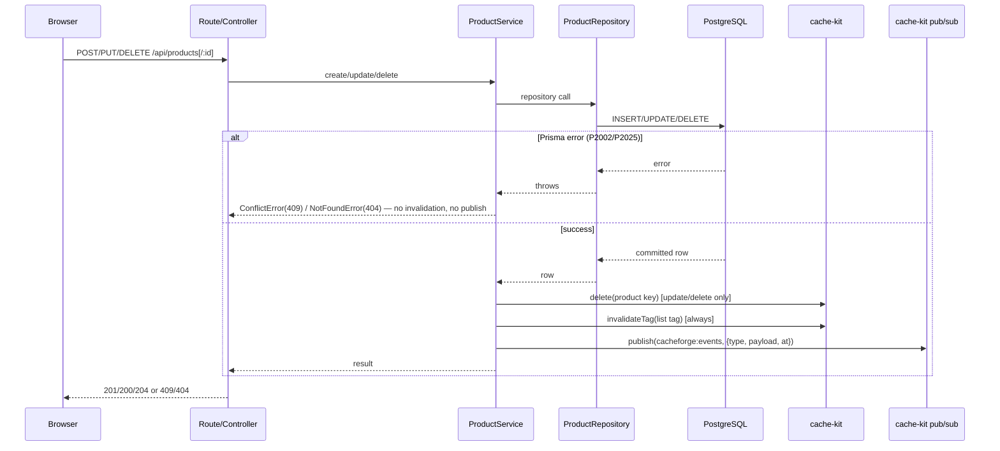

## 6. Cache-aside flow

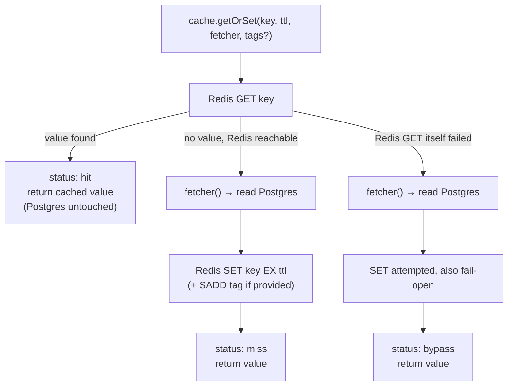

## 7. Cache invalidation (tag-set mechanism)

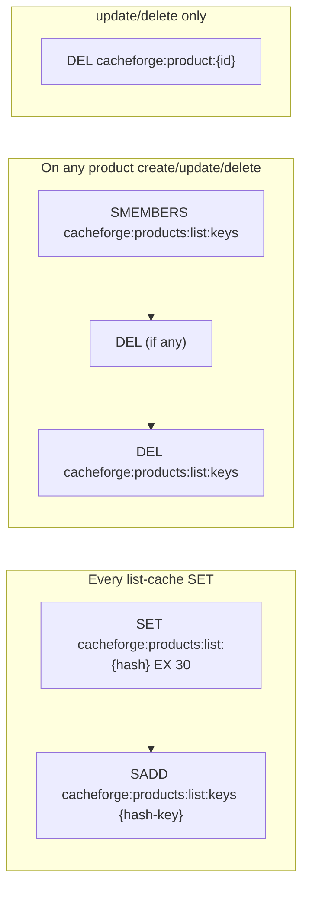

## 8. Metrics flow

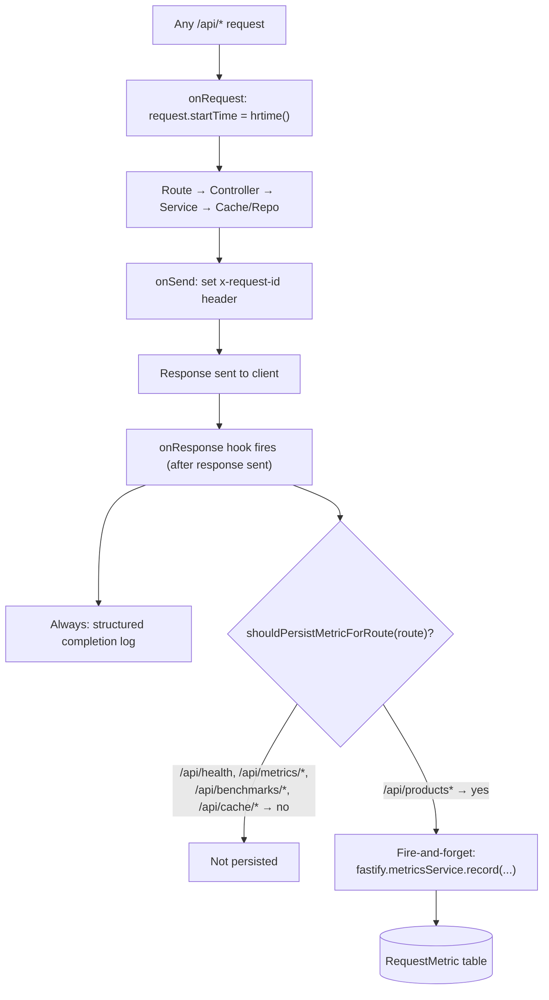

## 9. Benchmark flow

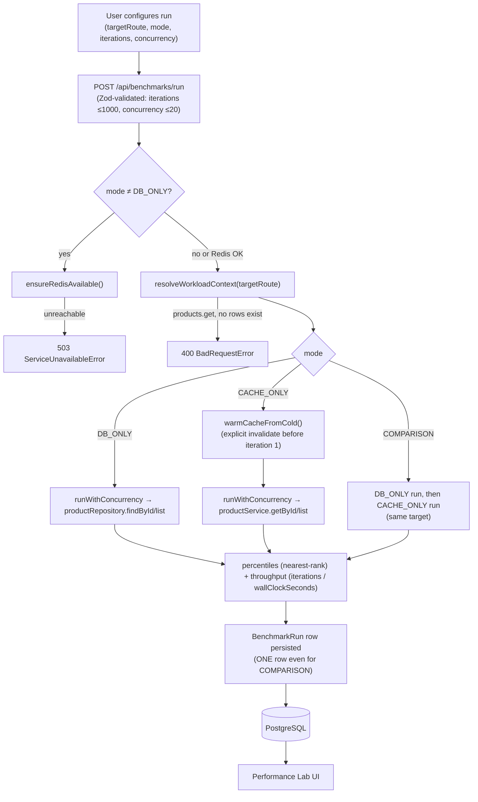

## 10. Failure handling

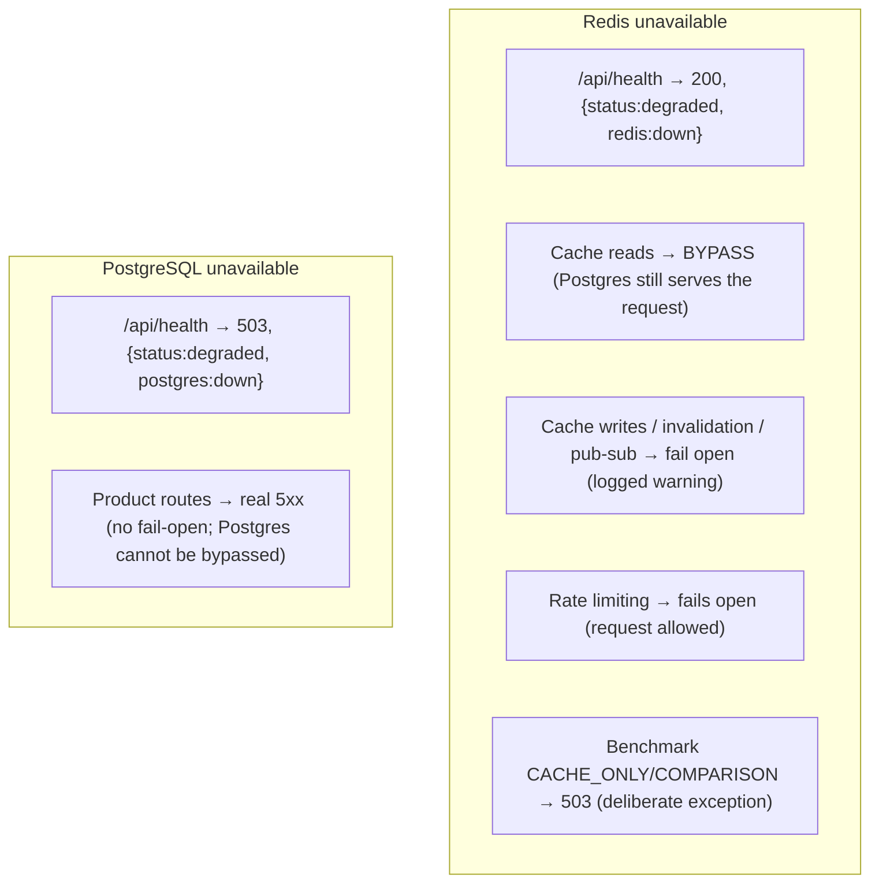

## 11. Deployment architecture (target, not yet provisioned)

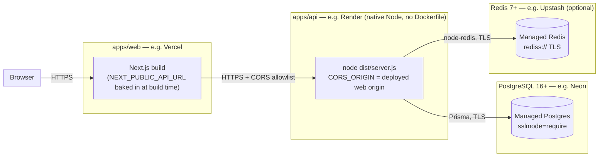

**Status: none of the above has been provisioned.** No cloud accounts,
databases, or Redis instances exist for this project yet — see
`DEPLOYMENT_READINESS.md` and `docs/TECHNICAL_ARCHITECTURE.md` §25.
