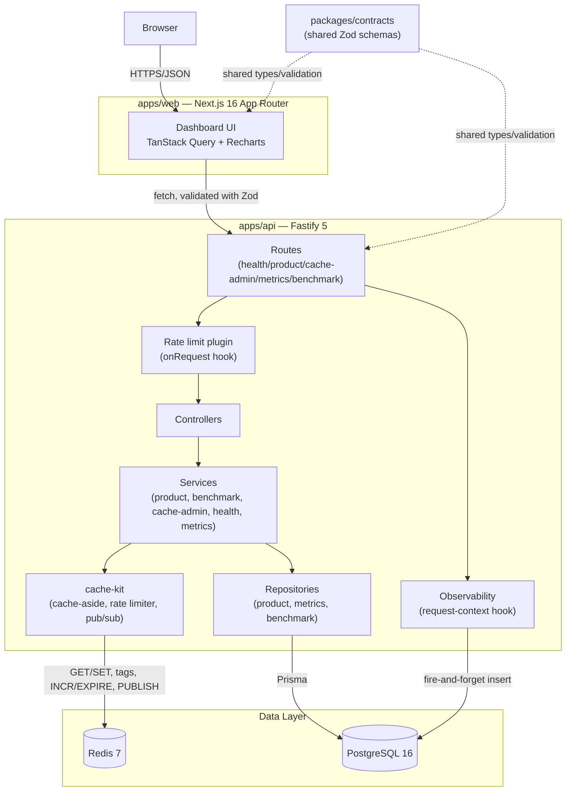
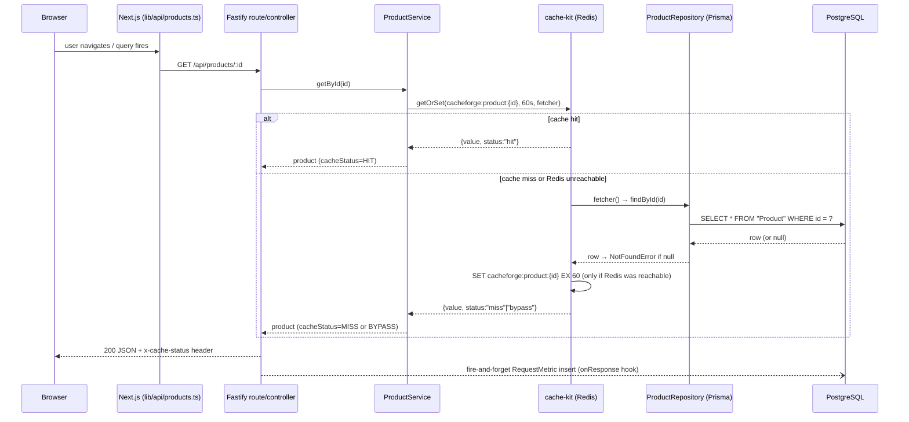
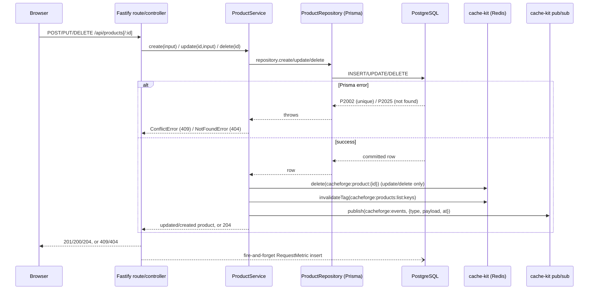
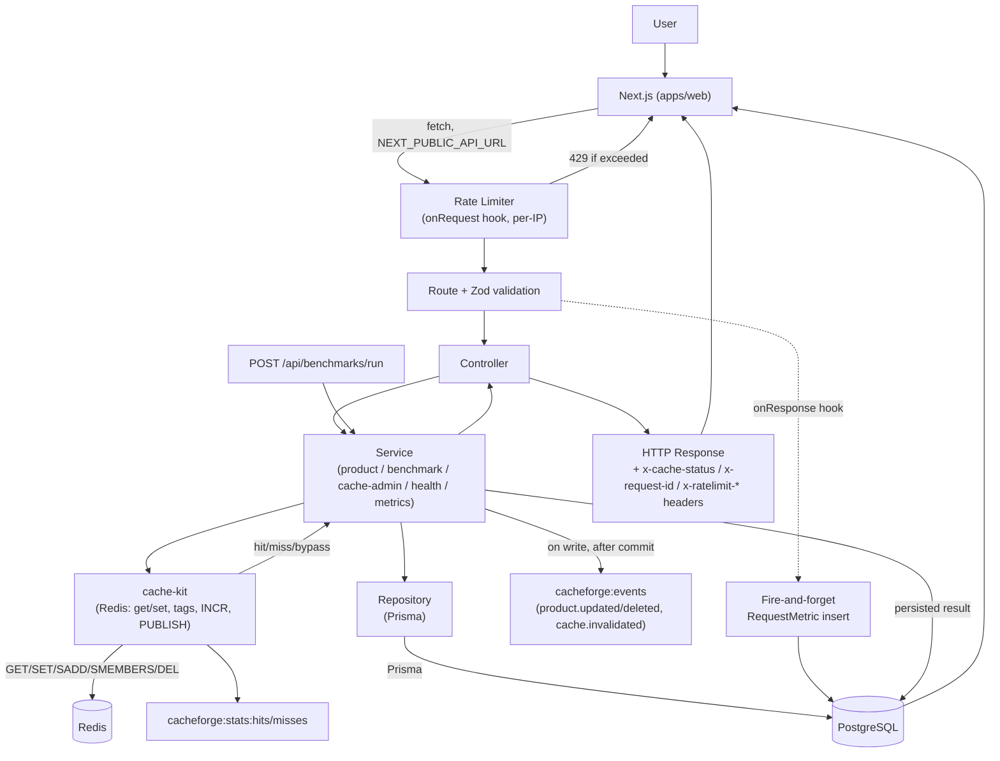

# CacheForge — Technical Architecture

> This is the deep engineering reference for CacheForge. It explains **how the
> system actually works today**, traced to real source files, with exact
> function/file citations wherever a claim can be checked against code. It
> does not restate `PROJECT_SPEC.md` (the original design intent) or the
> phase-by-phase `docs/architecture.md` / `docs/caching.md` /
> `docs/performance.md` / `docs/decisions.md` (the ADR-style build log) —
> read this document alongside them, not instead of them. Where this
> document and those files could appear to disagree, they don't: every claim
> below was re-verified against the current source during this audit.
>
> Anything that could not be verified from the repository is explicitly
> marked **Not confirmed from the current implementation.**

---

## 1. Project Overview

CacheForge is a production-style **API performance and Redis caching
platform**. It is not a CRUD app with caching bolted on — it is a small,
real product-catalog API (`Product` CRUD backed by PostgreSQL) used as the
**vehicle** for demonstrating, with real measurements, what a Redis
cache-aside layer actually does to latency and throughput, how cache
invalidation is done safely, how rate limiting and pub/sub work with Redis
outside of toy examples, and how all of that is observed end-to-end.

**Why Redis?** Redis is the one piece of infrastructure that can back a
cache, a rate limiter, and a pub/sub channel — three responsibilities an
in-process alternative (e.g. an LRU map) cannot fulfill correctly once
there is more than one API instance. The API is always _correct_ without
Redis (PostgreSQL is the source of truth); Redis exists purely to make it
_fast_.

**Why PostgreSQL?** It is the durable system of record for three things:
the product catalog itself (`Product`), a raw log of every real API request
(`RequestMetric`), and the results of every benchmark run
(`BenchmarkRun`). Nothing in CacheForge is allowed to be true only in
Redis — every fact that matters is provable from Postgres.

**What the Performance Lab does.** `POST /api/benchmarks/run` executes a
controlled, in-process benchmark (`DB_ONLY`, `CACHE_ONLY`, or `COMPARISON`)
against the real product-catalog code paths — not simulated numbers — and
persists the result so it can be inspected and compared over time. This is
the feature that turns "Redis makes things faster" from a claim into a
measured, reproducible number (see §16).

**What makes this more than a CRUD app.** The catalog itself is
deliberately simple (one table, five fields that matter). The engineering
weight is in: the cache-aside layer and its fail-open failure semantics
(§9–§11), the observability pipeline that measures and persists every real
request (§15), the benchmark engine that proves the cache's effect with
real numbers (§16), and a frontend that never fabricates data for a
loading/empty/error state (§4).

**The core idea:**

```
Observe   → every real request is measured (latency, status, cache status, source)
   ↓
Cache     → Redis cache-aside sits in front of PostgreSQL for product reads
   ↓
Measure   → the Performance Lab proves the cache's effect with real DB-vs-cache numbers
   ↓
Optimize  → invalidation, TTLs, and rate limiting are tuned against what was actually measured
```

---

## 2. High-Level Architecture



**Boundaries, in real project names:**

| Layer            | Package/app                         | Responsibility                                                                                  |
| ---------------- | ----------------------------------- | ----------------------------------------------------------------------------------------------- |
| Frontend         | `apps/web`                          | Next.js App Router dashboard; the only consumer of the API from a browser                       |
| Backend          | `apps/api`                          | Fastify server; routes → controllers → services → repositories/cache-kit                        |
| Shared contracts | `packages/contracts`                | Zod schemas + inferred TS types used by both `apps/api` and `apps/web`                          |
| Cache toolkit    | `packages/cache-kit`                | Framework-agnostic Redis cache-aside, rate limiter, pub/sub — no Fastify/Next/Prisma dependency |
| Data             | PostgreSQL 16 (via Prisma), Redis 7 | Postgres is the source of truth; Redis is an optional performance layer                         |

---

## 3. Monorepo Structure

```
cacheforge/
├── apps/
│   ├── web/                 → Next.js 16 dashboard (App Router)
│   └── api/                 → Fastify 5 API (Prisma + PostgreSQL + Redis)
├── packages/
│   ├── contracts/           → Shared Zod schemas/types (API ⇄ web)
│   └── cache-kit/           → Framework-agnostic Redis caching toolkit
├── docs/                    → Architecture, caching, performance, decisions (+ this file)
├── docker-compose.yml        → Local PostgreSQL 16 + Redis 7 only
├── PROJECT_SPEC.md           → Original design spec / source of intent
├── DEPLOYMENT_READINESS.md   → Phase 6 pre-deployment audit
└── README.md                 → Entry point, quickstart
```

Responsibilities, one line each:

- **`apps/web`** — Next.js dashboard: landing page, Overview Dashboard, Performance Lab, Cache Explorer, API Explorer, System Health, Architecture, Documentation.
- **`apps/api`** — Fastify API implementing Product CRUD, cache-aside, rate limiting, pub/sub, metrics persistence, and the benchmark engine.
- **`packages/contracts`** — the single definition of "what a Product/health response/metrics summary/benchmark run looks like over the wire"; both apps import it via `workspace:*`.
- **`packages/cache-kit`** — `createCache`, `createRateLimiter`, `createPubSub`, `createRedisClient`: none of them know about Fastify, Prisma, or CacheForge's own `cacheforge:` key naming. `apps/api` is the only place that decides what the keys/events actually mean.
- **`docs/`** — `architecture.md`, `caching.md`, `performance.md`, `decisions.md` are the phase-by-phase build record (still accurate, re-verified during this audit); this file (`TECHNICAL_ARCHITECTURE.md`) is the synthesized deep reference; `ARCHITECTURE_DIAGRAM.md`, `DEVELOPER_GUIDE.md`, `HOW_CACHEFORGE_WORKS.md`, `INTERVIEW_GUIDE.md` are new companion documents (see each file).

No `Dockerfile` exists anywhere in the repository — `docker-compose.yml` provisions only local PostgreSQL/Redis; `apps/api` and `apps/web` run directly via `pnpm`/Node (see §23).

---

## 4. Frontend Architecture (`apps/web`)

**Stack:** Next.js `16.3.5` (App Router), React `19.2.8`, TanStack Query
`^5.90.5`, Recharts `^3.3.1`, `react-markdown` `^10.1.0` (+`remark-gfm`,
`rehype-slug`), `react-hook-form` `^7.65.0` + `@hookform/resolvers`
(Zod resolver), Tailwind CSS v4, `@cacheforge/contracts` (`workspace:*`).

### Route structure

Two route groups under `apps/web/app/`, both sharing one root
`app/layout.tsx` (Geist/Geist Mono fonts + the TanStack Query provider from
`lib/providers.tsx`):

| Route group   | Path(s)                                                                                      | Shell                                                                                                  |
| ------------- | -------------------------------------------------------------------------------------------- | ------------------------------------------------------------------------------------------------------ |
| `(marketing)` | `/`                                                                                          | `SiteHeader`/`SiteFooter` (original landing layout)                                                    |
| `(app)`       | `/dashboard`, `/performance`, `/cache`, `/api-explorer`, `/health`, `/architecture`, `/docs` | `components/app-shell/app-shell.tsx` — desktop sidebar / mobile drawer, with a live `SystemStatusPill` |

**No `loading.tsx`, `error.tsx`, `not-found.tsx`, or `route.ts` files exist
anywhere under `apps/web/app/`.** Every loading/error/empty state is
handled _in-component_ via TanStack Query's `isPending`/`isError` plus three
shared primitives: `components/ui/skeleton.tsx`, `components/ui/error-state.tsx`
(`ErrorState` + `InlineErrorBanner`), and `components/ui/empty-state.tsx`
(explicitly documented in its own source comment as "never substitute
fabricated rows/points").

`AppShell` (`components/app-shell/app-shell.tsx`) is a **Server Component**
by design (it never needs to re-render when navigating between internal
pages); `SidebarNav`/`MobileNav` are client components using
`usePathname()` for active-route highlighting.

### Data fetching

`lib/api/*.ts` is the **only** code that talks to the Fastify API. Every
function funnels through `apiRequest<T>()` in `lib/api/client.ts`, which:

1. Resolves the base URL from `NEXT_PUBLIC_API_URL` (falls back to
   `http://localhost:4000` if unset — `client.ts`'s `getBaseUrl()`).
2. Performs the `fetch()`, converting a network failure into `ApiNetworkError`.
3. On a non-2xx response, parses the JSON error body and throws `ApiError`
   (`status`, `code`, `message`, and Zod `details` when present).
4. On success, **validates the JSON body against the matching
   `@cacheforge/contracts` schema** (`schema.parse(json)`) before returning
   it — a backend/frontend contract drift fails loudly in development
   rather than rendering silently-wrong data.
5. Always returns a `latencyMs` measured client-side with `performance.now()`.

`lib/api/error-message.ts`'s `getErrorMessage()` is the single place a raw
thrown error (`ApiError` / `ApiNetworkError` / `ZodError` / other) becomes
user-facing text — used identically across the dashboard, Performance Lab,
Cache Explorer, and the Health page.

One exception: `lib/api/health.ts`'s `getHealth()` bypasses `apiRequest`
and parses the response body even on a non-2xx status, because a `503`
from a down Postgres is "still a valid, parseable health reading, not a
request failure" (source comment).

TanStack Query defaults (`lib/providers.tsx`): `staleTime: 5_000`,
`retry: 1`, `refetchOnWindowFocus: false`. `useHealth`, `useMetricsSummary`,
and `useRequestMetrics` each override `refetchOnWindowFocus: true` locally
so dashboard/health polling is visibility-aware: `refetchIntervalInBackground`
(default `false`, left unset) already pauses the interval while the tab is
hidden, and the local `refetchOnWindowFocus: true` fires one immediate
refetch when the tab becomes visible again, rather than waiting out the
rest of the interval. Polling intervals actually found in the codebase:

| Data                                                    | Interval                                                        | Pages using it                                                                                                                 |
| ------------------------------------------------------- | --------------------------------------------------------------- | ------------------------------------------------------------------------------------------------------------------------------ |
| `GET /api/metrics/summary`, `GET /api/metrics/requests` | 60s, visibility-aware                                           | Overview Dashboard                                                                                                             |
| `GET /api/cache/stats`, `GET /api/cache/keys`           | 5s                                                              | Cache Explorer                                                                                                                 |
| `GET /api/health` (`useHealth`, default)                | 60s, visibility-aware                                           | Overview Dashboard, Cache Explorer, System Health, and the app-shell `SystemStatusPill` (each an independent polling instance) |
| Benchmark history/detail                                | none — refetched only via mutation-triggered cache invalidation | Performance Lab                                                                                                                |

### Pages

| Page                   | Route           | Purpose                                                          | API dependencies                                                                                                                     | Key components                                                                                                                                        | Data displayed                                                                                                   | Interactions                                         | Loading/empty/error                                                                                                                                               |
| ---------------------- | --------------- | ---------------------------------------------------------------- | ------------------------------------------------------------------------------------------------------------------------------------ | ----------------------------------------------------------------------------------------------------------------------------------------------------- | ---------------------------------------------------------------------------------------------------------------- | ---------------------------------------------------- | ----------------------------------------------------------------------------------------------------------------------------------------------------------------- |
| **Landing**            | `/`             | Explain the product, route to Dashboard/Architecture/Performance | none directly on the page; `PerformancePreview` calls `GET /api/benchmarks`                                                          | `FlowDiagram` ×2, `PerformancePreview`                                                                                                                | Most recent real `COMPARISON` benchmark run (or a truthful "no benchmark yet" state)                             | CTA links                                            | Skeleton tiles while loading; explicit no-data text, never fabricated numbers                                                                                     |
| **Overview Dashboard** | `/dashboard`    | At-a-glance traffic + system health                              | `GET /api/metrics/summary`, `GET /api/metrics/requests`, `GET /api/health`                                                           | `KpiTiles`, `RequestVolumeChart` (bar), `LatencyScatterChart` (scatter), `RecentRequestsTable`, `TimeWindowSelector`                                  | Request count, cache hit rate, error rate, P50/P95/P99, Postgres/Redis status, per-route volume, recent requests | Change time window (15m/1h/24h/7d), manual "Refresh" | Per-card `Skeleton`/`ErrorState` w/ retry; charts show `EmptyState` when empty                                                                                    |
| **Performance Lab**    | `/performance`  | Run and inspect real DB-vs-cache benchmarks                      | `POST /api/benchmarks/run`, `GET /api/benchmarks`, `GET /api/benchmarks/:id`                                                         | `BenchmarkForm` (react-hook-form + Zod resolver), `BenchmarkResultPanel`, `BenchmarkHistoryTable`, `BenchmarkDetailSheet`, `LatencyDistributionChart` | Min/avg/P50/P95/P99, throughput, cache hit rate, improvement % for `COMPARISON`, run history                     | Submit a run, open a past run's detail               | Form disabled while pending; `InlineErrorBanner` on run failure (form state preserved); `EmptyState` for empty history                                            |
| **Cache Explorer**     | `/cache`        | Inspect/delete live Redis keys                                   | `GET /api/cache/stats`, `GET /api/cache/keys` (infinite query), `DELETE /api/cache/:key`, `GET /api/health` (Redis-down cross-check) | `CacheStatsPanel`, `CacheKeyTable`, `ConfirmDialog`                                                                                                   | Hit/miss/hit-rate, memory, connected clients; key/type/TTL list                                                  | Pattern filter, "Load more", delete-with-confirm     | Explicit "Redis unavailable" state (cross-checked against `/api/health`, not just the stats endpoint's own success/failure — see §18); `EmptyState` for zero keys |
| **API Explorer**       | `/api-explorer` | Try any of the 14 real endpoints from the browser                | whichever endpoint is selected, via a hand-curated catalog (`lib/api-explorer/catalog.ts`)                                           | `EndpointList`, `TryItPanel`, `ResponseViewer`                                                                                                        | Real status/headers/body/latency for the actual request sent                                                     | Fill form, Send, "Copy as curl"                      | Non-2xx responses render as normal responses (not swallowed); network failure → `InlineErrorBanner`                                                               |
| **System Health**      | `/health`       | Infra status with manual recheck                                 | `GET /api/health` (60s poll)                                                                                                         | `StatusBadge` ×3 (API/Postgres/Redis)                                                                                                                 | Overall status + per-service last-checked time and response time                                                 | "Recheck now"                                        | Skeleton per card while pending                                                                                                                                   |
| **Architecture**       | `/architecture` | Explain the real implementation                                  | none (static)                                                                                                                        | `SystemDiagram`, `FlowDiagram` ×2, `BranchDiagram`, `ComponentRoles` (11 hardcoded role cards)                                                        | n/a                                                                                                              | Link to `/docs`                                      | n/a                                                                                                                                                               |
| **Documentation**      | `/docs`         | Render this repo's own docs                                      | none (server-side file read via `lib/docs.ts`)                                                                                       | `DocsNav`, `MarkdownContent` (`react-markdown`)                                                                                                       | The 5 sections in `DOC_SECTIONS`: getting-started (`README.md`), architecture, caching, performance, decisions   | Switch section via `?doc=` query param               | `ErrorState` titled "Documentation unavailable" if the file can't be read                                                                                         |

The Documentation page's markdown is served from `apps/web/content/`, a
git-ignored, build-time copy of the real `README.md`/`docs/*.md`, produced
by `apps/web/scripts/copy-docs.mjs` (run as `predev`/`prebuild`) — this
keeps the docs page's file reads scoped under the Next.js project
directory for serverless output-file tracing (see §25/§26 and
`docs/decisions.md`'s 2026-09-27 entry). **Only those 5 files are wired
into the in-app Documentation page** — the new documents this audit adds
(`TECHNICAL_ARCHITECTURE.md`, `ARCHITECTURE_DIAGRAM.md`, `DEVELOPER_GUIDE.md`,
`HOW_CACHEFORGE_WORKS.md`, `INTERVIEW_GUIDE.md`) are **not** rendered by the
`/docs` page — they are repository-level references, viewed on GitHub or
in an editor. Wiring them into `DOC_SECTIONS` would be an application code
change and was deliberately left out of this documentation-only pass.

### Charts and accessibility

Exactly 3 components import Recharts, and each ships a screen-reader
fallback (`aria-hidden="true"` on the chart itself, plus an `sr-only`
table or text summary of the same data) — added in commit
`d390841 fix(web): add text/table fallbacks to charts for screen readers`:

- `components/dashboard/request-volume-chart.tsx` (`BarChart`) — `sr-only` table.
- `components/dashboard/latency-scatter-chart.tsx` (`ScatterChart`) — `sr-only` text pointing at the visible requests table.
- `components/performance/latency-distribution-chart.tsx` (`LineChart`) — `sr-only` text pointing at the visible stat tiles.

`FlowDiagram`/`BranchDiagram`/`SystemDiagram` (used on Landing/Architecture)
are **not** chart-library output — they are dependency-free, hand-built
`<div>`-based diagrams (no Mermaid/diagramming library in the frontend).

### Cache Components (Next.js 16)

`next.config.ts` does **not** set `cacheComponents: true` — Next 16's
opt-in render-level caching is left disabled, deliberately, because the
dashboard/health/cache pages must reflect current backend/Redis state on
every load; data freshness is handled entirely by TanStack Query polling
instead (`docs/decisions.md`, 2026-09-13 entry). The only config actually
set is `outputFileTracingRoot` (pointed at the monorepo root, standard
practice for a pnpm workspace).

---

## 5. Frontend → Backend Communication

```
Browser
 ↓ user interaction / poll tick
Next.js Client Component (TanStack Query hook)
 ↓ calls a lib/api/*.ts function
API client (lib/api/client.ts → apiRequest<T>())
 ↓ fetch(`${NEXT_PUBLIC_API_URL}${path}`)
Fastify API (rate limiter → route → controller → service → cache/repository)
 ↓ JSON response (+ x-cache-status, x-request-id, x-ratelimit-* headers)
Frontend validates the body against the matching @cacheforge/contracts schema
 ↓
TanStack Query cache updates → component re-renders
```

`NEXT_PUBLIC_API_URL` is the **only** server the browser is ever allowed to
talk to (never PostgreSQL/Redis directly). It is inlined into the client
JS bundle **at build time** — setting it only at runtime has no effect
(Next.js's own `NEXT_PUBLIC_*` convention). Default: `http://localhost:4000`.

### Frontend feature → API endpoint table

| Frontend feature                                                     | API endpoint                          | Method              | Purpose                                                          |
| -------------------------------------------------------------------- | ------------------------------------- | ------------------- | ---------------------------------------------------------------- |
| Overview Dashboard KPI tiles / route table                           | `/api/metrics/summary`                | GET                 | Aggregate P50/P95/P99, error rate, cache hit rate over a window  |
| Overview Dashboard recent-requests table & scatter chart             | `/api/metrics/requests`               | GET                 | Recent individual request log                                    |
| System status pill / Health page / Cache Explorer's Redis-down check | `/api/health`                         | GET                 | Liveness/readiness for API, Postgres, Redis                      |
| Performance Lab — run a benchmark                                    | `/api/benchmarks/run`                 | POST                | Execute a DB_ONLY/CACHE_ONLY/COMPARISON run and persist it       |
| Performance Lab — history table                                      | `/api/benchmarks`                     | GET                 | List past benchmark runs                                         |
| Performance Lab — detail sheet                                       | `/api/benchmarks/:id`                 | GET                 | One run's full detail (raw latencies, comparison)                |
| Cache Explorer — stats panel                                         | `/api/cache/stats`                    | GET                 | Redis hit/miss/hit-rate, memory, connected clients               |
| Cache Explorer — key list                                            | `/api/cache/keys`                     | GET                 | Cursor-paginated, `cacheforge:`-namespaced key list              |
| Cache Explorer — delete key                                          | `/api/cache/:key`                     | DELETE              | Manually expire one key (namespace-restricted)                   |
| API Explorer — any of 14 endpoints                                   | (all of the above, plus Product CRUD) | GET/POST/PUT/DELETE | Direct, unvalidated pass-through to the real API for exploration |

`lib/api/products.ts` (Product CRUD wrapper) exists and is fully
implemented, but **no page currently calls it** — the app has no
dedicated product-management UI; only the API Explorer touches Product
endpoints, and it does so through its own `execute-request.ts`, not
`lib/api/products.ts`.

---

## 6. Backend Architecture (`apps/api`)

Strictly one-directional layering:

```
Routes → Controllers → Services → Repositories / cache-kit → Prisma/Redis
```

| Layer         | Directory                          | Owns                                                                                                                                                               | Never touches                 |
| ------------- | ---------------------------------- | ------------------------------------------------------------------------------------------------------------------------------------------------------------------ | ----------------------------- |
| Routes        | `src/routes/*.route.ts`            | HTTP method/path, Zod schema attachment (via `fastify-type-provider-zod`), wiring a controller                                                                     | Business logic, Prisma, Redis |
| Controllers   | `src/controllers/*.controller.ts`  | Translating `request`/`reply` ⇄ service calls; setting response headers (`x-cache-status`) and status codes                                                        | Prisma, Redis, business rules |
| Services      | `src/services/*.service.ts`        | Business logic — this is where cache-aside decisions, invalidation, and pub/sub triggers live                                                                      | Fastify's `request`/`reply`   |
| Repositories  | `src/repositories/*.repository.ts` | The only layer that imports Prisma; thin, query-shaped functions                                                                                                   | Any caching awareness         |
| Plugins       | `src/plugins/*.plugin.ts`          | Cross-cutting infra registered as Fastify decorators (`prisma`, `redis`, `cache`, `readRateLimiter`, `writeRateLimiter`, `pubsub`, `metricsService`, CORS, Helmet) | —                             |
| Observability | `src/observability/*`              | Request timing, structured logging, fire-and-forget metrics persistence                                                                                            | —                             |
| Middleware    | `src/middleware/error-handler.ts`  | Global error→status-code mapping                                                                                                                                   | —                             |
| Schemas       | `src/schemas/*.schema.ts`          | Thin re-export shims from `packages/contracts` (no schemas are defined locally in `apps/api`)                                                                      | —                             |

**Why repositories don't own caching:** a repository's only job is "what
does this query look like against Postgres" — it has no concept of a TTL,
a tag, or a cache key. This means the exact same `findById`/`list`
functions are reused unmodified by both the real cache-aside routes _and_
the benchmark engine's `DB_ONLY` mode (§16), which must bypass caching
entirely to measure raw database latency.

**Why services make cache decisions:** `product.service.ts` is where
`getById`/`list` call `cache.getOrSet(key, ttl, fetcher, {tags})` and where
`create`/`update`/`delete` invalidate the relevant keys/tags and publish a
pub/sub event — because the cache-aside _policy_ (which key, which TTL,
which tag, invalidate-after-what) is a business decision about the
product-catalog domain, not a generic infrastructure concern. `cache-kit`
itself has no idea what a "product" is; it only knows keys, TTLs, and tags.

### Plugin registration order (`src/server.ts`)

```
requestContextPlugin → corsPlugin → helmetPlugin → prismaPlugin
  → redisPlugin → metricsPlugin → rateLimitPlugin
    → routes: healthRoutes, productRoutes, cacheAdminRoutes,
              metricsRoutes, benchmarkRoutes   (all under /api)
```

`metricsService` is decorated on the **root** Fastify instance
(`plugins/metrics.plugin.ts`, wrapped in `fastify-plugin`), unlike
`productService`/`cacheAdminService`/`healthService` (each decorated
inside its own route file) — because the global `onResponse` hook in
`observability/request-context.plugin.ts` runs outside any single route
file's encapsulation context and needs to reach it. `benchmark.route.ts`
similarly constructs its **own** second `ProductService` instance from the
same root-level `repository`/`cache`/`pubsub` primitives, rather than
promoting `productService` to root scope — since it is a stateless
factory, a second instance behaves identically to the first.

### Example: `product.service.ts` file map

|               |                                                                                                                                                                                    |
| ------------- | ---------------------------------------------------------------------------------------------------------------------------------------------------------------------------------- |
| **File**      | `apps/api/src/services/product.service.ts`                                                                                                                                         |
| **Purpose**   | Cache-aside decisions + write-path invalidation/pub-sub for the Product domain                                                                                                     |
| **Called by** | `controllers/product.controller.ts`, and (a second instance) `benchmark.route.ts` for `CACHE_ONLY`/`COMPARISON` runs                                                               |
| **Calls**     | `repositories/product.repository.ts` (Prisma), `packages/cache-kit`'s `cache.getOrSet`/`delete`/`invalidateTag`, `packages/cache-kit`'s `pubsub.publish` (via `events.ts` helpers) |

---

## 7. Complete Product Read Flow

`GET /api/products/:id`, browser to database:



**Source files involved:**

| Step                               | File                                                           |
| ---------------------------------- | -------------------------------------------------------------- |
| Route + schema                     | `apps/api/src/routes/product.route.ts`                         |
| Controller (sets `x-cache-status`) | `apps/api/src/controllers/product.controller.ts`               |
| Cache-aside decision               | `apps/api/src/services/product.service.ts` (`getById`)         |
| Cache-aside primitive              | `packages/cache-kit/src/cache.ts` (`getOrSet`)                 |
| Key naming                         | `apps/api/src/cache/keys.ts` (`productKey(id)`)                |
| Database access                    | `apps/api/src/repositories/product.repository.ts` (`findById`) |
| Metrics persistence                | `apps/api/src/observability/request-context.plugin.ts`         |

`getOrSet`'s three real outcomes: **`hit`** (Redis reachable, value found —
Postgres never touched), **`miss`** (Redis reachable, no value — Postgres
read, Redis populated), **`bypass`** (Redis unreachable — Postgres read,
Redis write skipped). The controller maps `hit→HIT`, `miss→MISS`,
`bypass→BYPASS` into the `x-cache-status` response header and the
persisted `RequestMetric.cacheStatus`.

`GET /api/products` (the list endpoint) follows the identical shape, with
one difference: its cache key is `cacheforge:products:list:{hash}` (TTL
30s) and its `cache.getOrSet` call passes `{ tags: [PRODUCT_LIST_TAG] }` so
the entry can be invalidated in bulk on any product write (§11).

---

## 8. Product Write Flow

`POST` / `PUT` / `DELETE /api/products[/:id]`:



**Exact invalidation per operation** (`apps/api/src/services/product.service.ts`):

| Operation | Cache invalidation                                                                   | Pub/sub event     |
| --------- | ------------------------------------------------------------------------------------ | ----------------- |
| `create`  | `cache.invalidateTag(PRODUCT_LIST_TAG)` only — there is no existing per-item key yet | `product.updated` |
| `update`  | `cache.delete(productKey(id))` **and** `cache.invalidateTag(PRODUCT_LIST_TAG)`       | `product.updated` |
| `delete`  | `cache.delete(productKey(id))` **and** `cache.invalidateTag(PRODUCT_LIST_TAG)`       | `product.deleted` |

Invalidation and the pub/sub publish only ever run **after** the Prisma
call has actually committed — a rejected write (400/404/409) never touches
the cache or publishes anything (verified by
`test/product-events.integration.test.ts`). There is no separate
`"product.created"` event type; both create and update publish
`"product.updated"`.

**Tag invalidation, exactly:** `cache.invalidateTag(tag)`
(`packages/cache-kit/src/cache.ts`) does `SMEMBERS tag` → `DEL` every
member (only if any exist) → `DEL tag` itself. Every list-cache `set()`
call registers its own key into that same set via `SADD tag key`
(`packages/cache-kit/src/cache.ts`'s `set()`). This is the only
"clever" piece of the cache design and it is the reason `KEYS`/pattern
scanning never appears on a write path — confirmed by a repo-wide grep:
zero code matches for `KEYS `/`FLUSHALL`/`FLUSHDB` anywhere outside prose
in `PROJECT_SPEC.md`.

---

## 9. Redis Architecture

Redis backs four distinct responsibilities, all mediated through
`packages/cache-kit` and namespaced under `cacheforge:` by `apps/api/src/cache/keys.ts`:

| Redis feature        | Key / channel                                                   | Purpose                                               | TTL                             | Read/Write                                                     |
| -------------------- | --------------------------------------------------------------- | ----------------------------------------------------- | ------------------------------- | -------------------------------------------------------------- |
| Single product cache | `cacheforge:product:{id}`                                       | Cached product JSON                                   | 60s                             | `cache.getOrSet` (read+write)                                  |
| Product list cache   | `cacheforge:products:list:{sha1(page,pageSize,category)[0:16]}` | Cached paginated/filtered list JSON                   | 30s                             | `cache.getOrSet` (read+write)                                  |
| List-cache tag set   | `cacheforge:products:list:keys`                                 | Tracks active list-cache keys for bulk invalidation   | none (cleared with its members) | `SADD` on every list `set()`; `SMEMBERS`+`DEL` on invalidation |
| Read rate limiter    | `cacheforge:ratelimit:read:{ip}:{windowStart}`                  | Fixed-window request counter, non-write methods       | window length (default 60s)     | `INCR` + `EXPIRE` (first increment only)                       |
| Write rate limiter   | `cacheforge:ratelimit:write:{ip}:{windowStart}`                 | Fixed-window request counter, `POST/PUT/PATCH/DELETE` | window length (default 60s)     | `INCR` + `EXPIRE` (first increment only)                       |
| Cache statistics     | `cacheforge:stats:hits`, `cacheforge:stats:misses`              | Cumulative real hit/miss counters                     | none (cumulative)               | `INCR` on every `getOrSet` outcome                             |
| Domain/cache events  | `cacheforge:events`                                             | Pub/Sub channel                                       | n/a (not persisted)             | `PUBLISH` / `SUBSCRIBE`                                        |

All keys share the `cacheforge:` namespace (`NAMESPACE = "cacheforge"` in
`apps/api/src/cache/keys.ts`), which is what lets the Cache Explorer's
`GET /api/cache/keys` safely `SCAN MATCH cacheforge:*` without any risk of
touching another application's keys on a shared Redis instance.

### Connection model

One Redis connection is created per API process
(`apps/api/src/plugins/redis.plugin.ts`), via `packages/cache-kit`'s
`createRedisClient(url, socketOptions)`:

```ts
// packages/cache-kit/src/redis-client.ts
export function createRedisClient(url, socket) {
  return createClient({ url, socket, disableOfflineQueue: true });
}
```

- **`disableOfflineQueue: true` is hardcoded inside cache-kit itself** —
  not optional. node-redis's default behavior is to _queue_ commands
  issued while disconnected and wait for reconnection (hanging) rather
  than rejecting immediately; without this flag, every fail-open
  `try/catch` in `cache.ts`/`rate-limit.ts`/`pubsub.ts` would never
  actually catch anything during a real outage — a request would just
  hang. This was discovered by manually stopping the real Redis container
  mid-run (`docs/decisions.md`, 2026-09-14 entry), not by an automated test.
- **`connectTimeout: 5000` is supplied by `apps/api`**, not a cache-kit
  default (`redis.plugin.ts` passes it explicitly) — so a genuinely
  unreachable Redis fails each connection attempt within 5 seconds rather
  than an OS-level TCP timeout.
- **Pub/sub duplicates the connection.** `createPubSub`'s `subscribe()`
  calls `redis.duplicate()` and connects a second client, because a Redis
  connection in subscriber mode can no longer run other commands — this
  keeps the shared client free for cache/rate-limit operations.
- The Prisma connection is lazy (an unreachable Postgres at boot doesn't
  prevent the server from starting); the Redis client's `.connect()` call
  is wrapped in try/catch that only logs a warning on failure — so an
  unreachable Redis at boot also doesn't prevent startup, consistent with
  Redis being optional infrastructure.

### Failure/timeout behavior summary

| Condition                                        | Behavior                                                                                                                                                                |
| ------------------------------------------------ | ----------------------------------------------------------------------------------------------------------------------------------------------------------------------- |
| Redis down when a cache read is attempted        | `getOrSet`'s underlying `GET` fails → treated as `bypass` → fetcher (Postgres) is called, cache write is skipped, response still returns 200 with `cacheStatus: BYPASS` |
| Redis down during a write's invalidation/publish | Both are individually fail-open (caught, logged as a warning) — the write itself has already committed to Postgres and is not affected                                  |
| Redis down during rate-limit `consume()`         | Fails open — `allowed: true` (the request is let through)                                                                                                               |
| Redis down, `/api/health` queried                | Reports `redis: "down"`, `status: "degraded"`, HTTP `200` (not `503` — see §18)                                                                                         |
| Redis slow/unreachable at process boot           | Each connection attempt bounded to 5s (`connectTimeout`); server still starts                                                                                           |

---

## 10. Cache-Aside Strategy

```
READ (product.service.ts getById/list)

  cache.getOrSet(key, ttl, fetcher, {tags?})
       ↓
   Redis GET key
    ├── value found            → status "hit"  → return cached value, Postgres untouched
    ├── no value (Redis up)    → status "miss"  → fetcher() reads Postgres → Redis SET key EX ttl (+ SADD tag) → return
    └── Redis GET itself fails → status "bypass" → fetcher() reads Postgres → Redis SET attempted but the whole set() call is also wrapped fail-open → return
```

**Why cache-aside (not write-through):** Postgres is the source of truth;
the API must be correct with Redis entirely absent. Cache-aside keeps that
invariant true by construction — there is no code path where Redis holds
data Postgres doesn't also have, and no code path that can _only_ be
served from Redis. Write-through would make every write pay a Redis round
trip and still need its own miss-on-read logic — more complexity for a
read-heavy catalog workload that doesn't need it.

**TTLs:** 60s for a single product (`TTL.PRODUCT`), 30s for a list query
(`TTL.PRODUCT_LIST`) — both constants in `apps/api/src/cache/keys.ts`,
matching `PROJECT_SPEC.md` §9 exactly (not independently re-derived).
Lists get a shorter TTL because any create/update/delete anywhere in a
category can affect a list result, and a list query is cheap to
recompute relative to the risk of staleness.

**Deterministic list-key hashing:** `productListKey(query)` builds a
canonical object with a _fixed key order_ — `{ page, pageSize, category }`
— `JSON.stringify`s it, and SHA-1-hashes the result (first 16 hex chars).
Because the shape/order never varies, two logically identical queries
always produce the same key, and two different queries always produce
different keys — verified by `test/product-cache.integration.test.ts`.

**Stale-data prevention:** invalidation always runs _synchronously, in the
same service call, after the database mutation itself has committed_
(§8) — there is no delay, queue, or eventual-consistency window between "the
write succeeded" and "the cache no longer holds the old value." The only
window where a cached value can be stale is the TTL itself (up to 60s/30s),
which is an accepted, explicit trade-off, not a bug.

**Redis-failure behavior:** see §9's failure table — every cache operation
degrades to "go straight to Postgres" rather than erroring.

---

## 11. Cache Invalidation

| Write    | Product key invalidated             | List cache invalidated | Mechanism                                  |
| -------- | ----------------------------------- | ---------------------- | ------------------------------------------ |
| `create` | — (no key exists yet)               | Yes                    | `invalidateTag(PRODUCT_LIST_TAG)`          |
| `update` | Yes (`DEL cacheforge:product:{id}`) | Yes                    | `cache.delete(...)` + `invalidateTag(...)` |
| `delete` | Yes (`DEL cacheforge:product:{id}`) | Yes                    | `cache.delete(...)` + `invalidateTag(...)` |

**Tag-set mechanics** (`packages/cache-kit/src/cache.ts`):

```ts
// on every list cache write:
await redis.set(key, JSON.stringify(value), { EX: ttlSeconds });
if (tags?.length) {
  await Promise.all(tags.map((tag) => redis.sAdd(tag, key)));
}

// on invalidateTag(tag):
const keys = await redis.sMembers(tag);
if (keys.length > 0) {
  await redis.del(keys);
}
await redis.del(tag);
```

**Why not `KEYS`/pattern-scanning on the write path:** `KEYS` is `O(n)`
over the entire keyspace and blocks Redis's single-threaded event loop
while it runs — unacceptable on a path that executes on every product
mutation. The tag-set approach makes invalidation an `O(members)`
operation against a known, bounded set instead. The **only** place `SCAN`
appears anywhere in the codebase is the read-only `GET /api/cache/keys`
admin endpoint (`apps/api/src/services/cache-admin.service.ts`), and it is
cursor-based (non-blocking) by construction. A repository-wide grep
confirms **zero** occurrences of `KEYS `/`FLUSHALL`/`FLUSHDB` in any `.ts`
source file.

**Why invalidation happens after the mutation, not before or during:** if
invalidation ran before the Postgres write committed (or the write later
failed), a concurrent reader could re-populate the cache with the
_pre_-write value immediately after invalidation, recreating exactly the
staleness bug invalidation exists to prevent. Running invalidation only
after a successful commit means the next cache miss can only ever read the
new, correct value.

Publishing (`product.updated`/`product.deleted`) happens in the same
post-commit step as invalidation — see §13.

---

## 12. Rate Limiting

**Algorithm:** fixed-window counter, implemented in
`packages/cache-kit/src/rate-limit.ts`:

```ts
async consume(identifier: string): Promise<RateLimitResult> {
  const now = Math.floor(Date.now() / 1000);
  const windowStart = now - (now % options.windowSeconds);
  const resetAt = new Date((windowStart + options.windowSeconds) * 1000);
  const key = `${options.keyPrefix}:${identifier}:${windowStart}`;

  const count = await redis.incr(key);
  if (count === 1) { await redis.expire(key, options.windowSeconds); }

  return {
    allowed: count <= options.max,
    limit: options.max,
    remaining: Math.max(0, options.max - count),
    resetAt,
  };
  // on any Redis error: return { allowed: true, ... } — fail open
}
```

**Wiring** (`apps/api/src/plugins/rate-limit.plugin.ts`, a global
`onRequest` hook):

- Applies to **every** `/api/*` request **except** ones starting with
  `/api/health`. (This is a _different, narrower_ exemption list than the
  metrics-persistence exclusion list in §15 — don't conflate the two.)
- Identifier = `request.ip`.
- `POST`/`PUT`/`PATCH`/`DELETE` → `fastify.writeRateLimiter` (default max
  **60**/window); everything else → `fastify.readRateLimiter` (default max
  **300**/window).
- Always sets `x-ratelimit-limit`/`x-ratelimit-remaining` response headers.
- On `!allowed`: sets a `retry-after` header (seconds until the window
  resets, minimum 1) and throws `TooManyRequestsError`, mapped to **HTTP
  429** by the global error handler.

**Defaults** (env vars, all optional — _current implementation defaults,
not a production traffic study_):

| Variable                       | Default |
| ------------------------------ | ------- |
| `RATE_LIMIT_WINDOW_SECONDS`    | 60      |
| `RATE_LIMIT_MAX` (read)        | 300     |
| `RATE_LIMIT_WRITE_MAX` (write) | 60      |

**Why Redis-backed, not in-process memory:** an in-memory counter is
per-process — with `N` API instances behind a load balancer, the
effective limit becomes `N × configured limit`, which is meaningless as a
control. A counter shared in Redis means the limit means the same thing
regardless of how many API instances run.

**Why fixed-window, not sliding-window/token-bucket:** it's the simplest
scheme that is still correct and fully explainable — at the cost of
allowing up to ~2x burst exactly at a window boundary (two windows' worth
of requests can land back-to-back around the boundary). This trade-off is
explicit, not hidden (`PROJECT_SPEC.md` §25).

**Fail-open, deliberately:** on a Redis error, `consume()` returns
`allowed: true` — availability is prioritized over throttling. This is an
explicit, documented simplification: a real abuse-exposed production API
should fail closed or fall back to a local in-memory limiter instead.

**`/api/health` exemption:** monitoring/orchestration health-check traffic
should never be throttled, since a health check being rate-limited could
itself cause a false "unhealthy" signal to an orchestrator.

---

## 13. Pub/Sub

```
Publisher (product.service.ts / cache-admin.controller.ts)
   ↓ PUBLISH cacheforge:events {type, payload, at}
Redis channel: cacheforge:events
   ↓ SUBSCRIBE (on a duplicated connection)
Subscriber (any consumer that calls cache-kit's subscribe())
```

**Channel:** a single channel, `cacheforge:events` (constant
`EVENTS_CHANNEL` in `apps/api/src/cache/keys.ts`).

**Event types and when they fire** (`apps/api/src/events.ts`):

| Type                | Payload       | Fires from                                                                                                                                                                       |
| ------------------- | ------------- | -------------------------------------------------------------------------------------------------------------------------------------------------------------------------------- |
| `product.updated`   | `{ id, sku }` | `ProductService.create()` **and** `.update()` — there is no separate `product.created` type                                                                                      |
| `product.deleted`   | `{ id, sku }` | `ProductService.delete()`                                                                                                                                                        |
| `cache.invalidated` | `{ key }`     | `cache-admin.controller.ts`, only after a manual `DELETE /api/cache/:key` succeeds — **not** fired by product writes (those already imply invalidation via their own event type) |

**Message shape:** `{ type, payload, at: <ISO timestamp> }` —
`packages/cache-kit/src/pubsub.ts`'s `publish()` simply
`JSON.stringify`s this envelope and calls `redis.publish(channel, json)`.

**Publisher behavior:** `publish()` is fail-open (wrapped in try/catch,
never throws) and only ever called _after_ the triggering database
mutation has committed — a rejected write never publishes anything
(verified in `test/product-events.integration.test.ts`).

**Subscriber behavior:** `subscribe(channel, handler)` calls
`redis.duplicate()` to get a dedicated connection (a subscribed
connection can't run other Redis commands), connects it, and returns an
unsubscribe/close function. Handler JSON-parse failures are caught and
routed through the same `onError` callback as everything else in
cache-kit, never thrown into the event loop.

**Relationship to cache invalidation:** pub/sub in CacheForge is a
_notification_ mechanism, not the invalidation mechanism itself —
invalidation (§11) happens synchronously via `cache.delete`/`invalidateTag`
calls in the same service method; the pub/sub event is published
immediately after, as an observable signal that a write (and its
invalidation) happened. Nothing in the current codebase currently
subscribes to `cacheforge:events` on the frontend or elsewhere in
`apps/api` outside the integration tests — this channel is a demonstrated
capability, not (yet) driving a live UI feed. **Not confirmed from the
current implementation:** any production consumer of this channel beyond
the test suite.

---

## 14. PostgreSQL + Prisma

**Prisma version:** `7.10.0` (pinned to the exact matching stable release
for both `prisma` and `@prisma/client` — the `latest` dist-tag pointed at
a release candidate at the time this was chosen; see `docs/decisions.md`).

**Driver adapters, not the legacy engine:** this Prisma version's default
generator (`prisma-client`) produces a self-contained client at
`apps/api/src/generated/prisma` (git-ignored, regenerated via
`prisma generate`, wired into `postinstall`) and **requires** an explicit
driver adapter. CacheForge uses `@prisma/adapter-pg` wrapping `pg`:

```ts
new PrismaClient({ adapter: new PrismaPg({ connectionString }) });
```

`apps/api/prisma/schema.prisma`'s `datasource` block has no `url = env(...)`
line — the connection string is passed explicitly to the adapter
(`apps/api/src/plugins/prisma.plugin.ts`) and, separately, to the Prisma
CLI via `apps/api/prisma7.config.ts`.

**Models** (all three from the schema, verbatim):

```prisma
model Product {
  id          String   @id @default(cuid())
  sku         String   @unique
  name        String
  description String?
  category    String
  price       Decimal  @db.Decimal(10, 2)
  stock       Int      @default(0)
  createdAt   DateTime @default(now())
  updatedAt   DateTime @updatedAt

  @@index([category])
}

model RequestMetric {
  id          BigInt      @id @default(autoincrement())
  requestId   String
  method      String
  route       String
  statusCode  Int
  durationMs  Float
  cacheStatus CacheStatus @default(NOT_APPLICABLE)
  source      DataSource  @default(DB)
  createdAt   DateTime    @default(now())

  @@index([route, createdAt])
  @@index([createdAt])
}

enum CacheStatus { HIT MISS BYPASS NOT_APPLICABLE }
enum DataSource  { DB CACHE }

model BenchmarkRun {
  id             String        @id @default(cuid())
  label          String?
  targetRoute    String
  mode           BenchmarkMode
  iterations     Int
  concurrency    Int           @default(1)
  minMs          Float
  maxMs          Float
  avgMs          Float
  p50Ms          Float
  p95Ms          Float
  p99Ms          Float
  throughputRps  Float
  cacheHitRate   Float?
  rawLatenciesMs Json
  createdAt      DateTime      @default(now())
}

enum BenchmarkMode { DB_ONLY CACHE_ONLY COMPARISON }
```

**Relationships:** intentionally none between `Product` and the metrics
models — `RequestMetric`/`BenchmarkRun` are observational data about
_traffic_, joined to product data (where relevant) only loosely by route
string, not a foreign key. This avoids coupling the metrics pipeline to
catalog schema changes.

**Migrations:** exactly **one** migration exists —
`apps/api/prisma/migrations/20260913151753_init/` — creating all three
models, their enums, and their indexes in a single step. Verified against
a genuinely fresh, empty database during the deployment-readiness audit
(§25).

**Repositories are the only Prisma consumer.** `product.repository.ts`
exposes `findById`, `findBySku`, `list`, `create`, `update`, `delete` — no
try/catch, no caching. Prisma error translation happens one layer up, in
`product.service.ts`:

```ts
function isUniqueConstraintViolation(error) {
  return (
    error instanceof Prisma.PrismaClientKnownRequestError &&
    error.code === "P2002"
  );
}
function isRecordNotFound(error) {
  return (
    error instanceof Prisma.PrismaClientKnownRequestError &&
    error.code === "P2025"
  );
}
// create(): P2002 → ConflictError("Product with sku ... already exists")
// update()/delete(): P2025 → NotFoundError(`Product "${id}" not found`)
```

`metrics.repository.ts` does **all** aggregation in PostgreSQL —
`count(*) FILTER (...)`, `percentile_cont(...) WITHIN GROUP`,
`GROUP BY route, method` — never by pulling rows into Node (see §15 for
why this uses a different percentile method than the benchmark engine).

`benchmark.repository.ts` persists one `BenchmarkRun` row per completed
run, including `COMPARISON` mode (one row, not two — see §16).

**Seed data:** `apps/api/prisma/seed.ts` seeds exactly 6 demo products via
idempotent `upsert` on `sku` — and explicitly never seeds `RequestMetric`
or `BenchmarkRun` rows, since those must represent real measured traffic.

---

## 15. Request Metrics

```
Every /api/* request
 ↓ onRequest hook: request.startTime = process.hrtime.bigint()
Fastify handles the request (route → controller → service → cache/repo)
 ↓ onSend hook: sets x-request-id response header
 ↓ onResponse hook (request-context.plugin.ts)
   - durationMs = (hrtime.now() - startTime) / 1e6
   - logs a structured completion line (always)
   - if shouldPersistMetricForRoute(route): fire-and-forget
       fastify.metricsService.record({...}).catch(warn)
 ↓
PostgreSQL RequestMetric table (if persisted)
```

**What's captured per request:** `requestId`, `method`, `route`,
`statusCode`, `durationMs`, `cacheStatus` (`HIT`/`MISS`/`BYPASS`/
`NOT_APPLICABLE` — set on the request object by controllers that make a
cache decision, e.g. `product.controller.ts`), `source` (`DB`/`CACHE`).

**Exclusions from persistence** (`apps/api/src/observability/metrics-exclusions.ts`):

```ts
const EXCLUDED_METRIC_ROUTE_PREFIXES = [
  "/api/health",
  "/api/metrics",
  "/api/benchmarks",
  "/api/cache",
];
```

Rationale per prefix (from the source comment): `/api/health` is
monitoring traffic, not product traffic; `/api/metrics/*` would otherwise
recursively generate metrics about viewing the metrics dashboard;
`/api/benchmarks/*`'s own outer HTTP request duration is dominated by
however many iterations it ran internally, which would skew real traffic
percentiles as an outlier; `/api/cache/*` is developer/admin
introspection, not product traffic. **Only `/api/products*` is currently
persisted.** (Reminder: this list is distinct from — and broader than —
the rate-limiter's own exemption list, which is `/api/health` only; see §12.)

**Fire-and-forget, not queued:** the insert happens in `onResponse`,
which Fastify runs _after_ the response has already been sent — so its
latency is invisible to the caller whether or not it's awaited. It is
deliberately **not** awaited (`void fastify.metricsService.record(...).catch(...)`).
There is no in-memory queue accumulating pending writes; each request's
insert is one independent, bounded operation, so back-pressure comes from
Postgres/Prisma's own connection pool like any other query.

**Durability limitation (explicit, known):** if the process crashes in
the narrow window between "response sent" and "insert completed," that
one metric row is lost. Acceptable for aggregate-trend observability
(the project's stated purpose); not acceptable for audit-grade or
billing-grade data.

**Summary queries** (`metrics.repository.ts`, all computed in SQL):

- `getSummary(windowMinutes)` — `percentile_cont(0.5/0.95/0.99) WITHIN GROUP (ORDER BY "durationMs")`, error rate via `count(*) FILTER (WHERE "statusCode" >= 500)`, cache hit rate via `count(*) FILTER (WHERE "cacheStatus"='HIT')` over `count(*) FILTER (WHERE "cacheStatus" IN ('HIT','MISS','BYPASS'))` (returns `null`, not 0, if no cache-applicable requests occurred in the window).
- `getSummaryByRoute(windowMinutes)` — same aggregate style, `GROUP BY route, method`.
- `list(params)` — filterable by `windowMinutes`, `route`, `method`, `cacheStatus`, `source`, and `requestId` (the last one exists specifically to let a single request be traced end-to-end, per its schema comment).

**Why this uses a different percentile method than the benchmark engine:**
`percentile_cont` (linear interpolation) is appropriate for a live,
ever-growing SQL aggregate; the benchmark engine (§16) instead uses
nearest-rank on one fixed in-memory array from a single run. These are
deliberately different tools for different shapes of data, not an
inconsistency.

---

## 16. Performance Lab

```
User configures a run (targetRoute, mode, iterations, concurrency, label?)
 ↓
POST /api/benchmarks/run  (Zod-validated; 400 if out of bounds, never silently clamped)
 ↓
BenchmarkService.run()
 ├── ensureRedisAvailable() — for CACHE_ONLY/COMPARISON only; 503 if Redis unreachable
 ├── resolveWorkloadContext(targetRoute)
 │     - products.get  → picks the first existing product (page 1, pageSize 1); 400 if none exist
 │     - products.list → a fixed default query (page 1, pageSize 20)
 ├── DB_ONLY:      runWithConcurrency(iterations, concurrency, () => productRepository.findById/list)
 ├── CACHE_ONLY:   warmCacheFromCold() [explicit invalidate before iteration 1]
 │                 → runWithConcurrency(iterations, concurrency, () => productService.getById/list)
 └── COMPARISON:   runs DB_ONLY, then CACHE_ONLY, against the same target
 ↓
percentiles/throughput computed (nearest-rank; wall-clock / iterations)
 ↓
BenchmarkRun persisted (one row, even for COMPARISON) — only on success
 ↓
GET /api/benchmarks / GET /api/benchmarks/:id → Performance Lab UI
```

**Modes:**

- **`DB_ONLY`** — calls `productRepository.findById`/`.list` directly,
  bypassing `cache-kit` entirely. Every iteration is a real Postgres query.
- **`CACHE_ONLY`** — calls `productService.getById`/`.list` — the exact
  cache-aside code path the real routes use. Before the first iteration,
  the target's cache entry is explicitly invalidated
  (`cache.delete`/`invalidateTag`), guaranteeing iteration 1 is a real,
  measured MISS (which populates the cache) and every subsequent
  iteration is a real HIT. `cacheHitRate = hits / iterations` is reported
  exactly as measured (e.g. capped at `19/20 = 0.95` for 20 iterations),
  never assumed to be 100%. If Redis is unreachable, this mode returns
  **503** rather than silently running a degraded benchmark that would
  mislabel Postgres latency as cache latency.
- **`COMPARISON`** — runs `DB_ONLY` immediately followed by `CACHE_ONLY`
  against the _same_ target, so both sides measure the same workload.

**In-process, not HTTP-looped:** a benchmark run executes entirely inside
the API process, calling repository/service functions directly in a loop
— it never issues HTTP requests to itself. Looping real HTTP requests
would measure the network stack/Node's HTTP parsing overhead as much as
the thing actually being compared. The _outer_ `POST /api/benchmarks/run`
request's own HTTP overhead is excluded from every timed measurement.

**Timing:** each iteration timed with `process.hrtime.bigint()`
immediately around the repository/service call.

**Percentiles (nearest-rank method)**, `apps/api/src/benchmark/percentiles.ts`:

```ts
export function percentile(sortedAscending: number[], p: number): number {
  const n = sortedAscending.length;
  if (n === 0) return 0;
  const rank = Math.ceil((p / 100) * n);
  const index = Math.min(Math.max(rank - 1, 0), n - 1);
  return sortedAscending[index] ?? 0;
}
```

Always returns an actual observed sample (never interpolated) — chosen so
a reported P95 is independently reproducible from the run's own raw
`latenciesMs` array. Unit-tested against hand-computed values for 1, 2,
10, and 100 samples.

**Throughput:** `iterations / totalWallClockSeconds`, from a _single_
`process.hrtime.bigint()` measurement wrapped around the entire workload
(including however many iterations ran concurrently) — never derived by
averaging individual latencies (a dedicated test proves these two
computations are not interchangeable).

**Concurrency:** a small fixed-size worker pool
(`apps/api/src/benchmark/concurrency.ts`) — at most
`min(concurrency, iterations)` calls are ever in flight. Default `1`
(strictly sequential); capped at `20` per run, alongside a `1000`-iteration
cap — both enforced by Zod (`benchmarkRunRequestSchema`), rejected with
400 if exceeded, never silently clamped.

**Isolation:** benchmarks are read-only against product data — only
`findById`/`list` are ever called, never `create`/`update`/`delete`; a
`products.get` run reuses the same one existing product's ID for every
iteration. Verified by `test/benchmark.integration.test.ts`'s isolation
test (product count and the target row unchanged after a run).

**Persistence:** every _completed_ run is saved as one `BenchmarkRun` row
(`repository.create()` is the last step — a failed/rejected run never
creates a row). For `DB_ONLY`/`CACHE_ONLY`, `rawLatenciesMs` is a flat
`number[]`. For `COMPARISON` — still exactly **one row**, per
`PROJECT_SPEC.md` §10's framing of the response as "one `BenchmarkRun`...
including both sub-results" — the top-level stat columns mirror the
cache-only ("headline") side, and `rawLatenciesMs` instead holds a
structured object:

```json
{
  "dbOnly":    { "latenciesMs": [...], "throughputRps": 393 },
  "cacheOnly": { "latenciesMs": [...], "throughputRps": 589, "hits": 29, "total": 30 }
}
```

On `GET /:id`, each side's min/max/avg/percentiles are **recomputed from
the stored raw latencies** (deterministic, no drift risk between a stored
summary and the raw data); `latencyImprovementPct`, `p95ImprovementPct`,
`throughputImprovementPct` are derived as `((before - after) / before) * 100`
(`null` if `before <= 0`) — never a hardcoded or assumed percentage.

**Benchmark history:** `GET /api/benchmarks` lists past runs (lightweight
summary shape); `GET /api/benchmarks/:id` returns the full detail
including raw latencies and, for `COMPARISON`, the recomputed comparison
object.

**Historical numbers, explicitly labeled:** `docs/performance.md` records
one real, locally-measured run (30 iterations, `products.get`,
`COMPARISON`) showing ~33% lower average latency, ~37% lower P95, and
~50% higher throughput with the cache warm. These are **one local Docker
run on one developer machine** — not a universal production guarantee,
and not reproduced verbatim here; see `docs/performance.md`'s own
"Limitations" section before quoting these numbers elsewhere.

---

## 17. Observability

| Surface                                 | Backed by                                                  | Comes from                                                           |
| --------------------------------------- | ---------------------------------------------------------- | -------------------------------------------------------------------- |
| `GET /api/health`                       | Live pings (`SELECT 1` / `PING`), computed at request time | Postgres + Redis, checked in parallel                                |
| `GET /api/metrics/summary`, `/requests` | PostgreSQL `RequestMetric` table                           | Real, persisted API traffic (product routes only)                    |
| `GET /api/cache/stats`                  | Redis `INCR` counters + `INFO` subset                      | Redis, live                                                          |
| `GET /api/cache/keys`                   | Redis `SCAN`                                               | Redis, live                                                          |
| `GET /api/benchmarks[/:id]`             | PostgreSQL `BenchmarkRun` table                            | Real, persisted benchmark runs                                       |
| Structured logs                         | Pino                                                       | Every request, always (regardless of metrics-persistence exclusions) |

Nothing here is generated client-side or fabricated for demo purposes —
every number displayed by the frontend traces back to either a live Redis
read, a live Postgres read/aggregate, or a live health ping.

**Logging:** Pino (`apps/api/src/observability/logger.ts`) — plain JSON in
`production`/default, `pino-pretty` only in `development`, fully silenced
in `test`. Request IDs are generated per request
(`genReqId: () => randomUUID()` in `server.ts`), attached to every log
line, returned to the client via the `x-request-id` response header, and
persisted alongside the `RequestMetric` row — so a single request can be
correlated across logs and stored metrics. Request **bodies are never
logged**: the structured completion log line includes only
`requestId, method, route, statusCode, durationMs, cacheStatus, source` —
confirmed by inspection (no `body`/`payload` field anywhere in the log
call, no custom Pino serializers configured).

---

## 18. Failure Handling

### Redis failure

```
Redis unavailable
 ↓
/api/health reports redis:"down", status:"degraded" (HTTP 200, unless Postgres is also down)
 ↓
Cache reads → BYPASS (Postgres read still succeeds, response still 200)
 ↓
Cache writes/invalidation/pub-sub → fail open (logged warning, write itself unaffected)
 ↓
Rate limiting → fails open (request allowed)
 ↓
Benchmark CACHE_ONLY/COMPARISON → 503 (the one deliberate exception to fail-open,
                                        since a degraded benchmark would mislabel
                                        Postgres latency as cache latency)
```

This was verified against the real Docker Redis container, not mocked
(`docs/caching.md`): stopping Redis mid-run produced `GET /api/products/:id`
→ 200 with `x-cache-status: BYPASS`, `POST /api/products` → 201,
`GET /api/health` → `{"status":"degraded","redis":"down"}`, and
`GET /api/cache/stats` degraded gracefully rather than erroring — all
within milliseconds (thanks to `disableOfflineQueue`), no hang. Restarting
Redis afterward, the very next request already showed `redis: "up"` again,
with cache-aside resuming (MISS then HIT on the next two reads).

**One documented gap:** `GET /api/cache/stats` fails open to a
_successful_ 200 with all-zero counters when Redis is down — which looks
identical to a freshly-empty cache. The Cache Explorer works around this
by additionally cross-checking `GET /api/health` and showing an explicit
"Redis unavailable" state whenever `redis: "down"`, regardless of what the
stats endpoint itself reports (`docs/decisions.md`, 2026-09-20 entry).

### PostgreSQL failure

```
PostgreSQL unavailable
 ↓
/api/health → 503, {status:"degraded", postgres:"down"}
 ↓
Product routes → 5xx (Prisma throws; not silently swallowed, not fail-open —
                       Postgres is the source of truth and cannot be bypassed)
```

Unlike Redis, there is no fail-open behavior for Postgres anywhere in the
codebase — a down Postgres is a real outage, and the API says so via 503
on health and real errors on product routes, rather than pretending to
still function.

### Recovery

- **Redis:** reconnects automatically (node-redis's default reconnect
  strategy is left enabled — only each individual connection attempt's
  duration is bounded via `connectTimeout`); the next successful operation
  after reconnection resumes normal cache-aside behavior with no manual
  intervention.
- **PostgreSQL:** the Prisma connection is lazy/pooled; once reachable
  again, subsequent requests succeed without an API restart.
- **Benchmarks:** a `CACHE_ONLY`/`COMPARISON` run attempted while Redis is
  down simply returns 503 and creates no `BenchmarkRun` row; once Redis is
  back, a retried run behaves normally.

---

## 19. API Reference

Base path: `/api`. Every request/response body is validated against a
shared Zod schema from `@cacheforge/contracts`.

| Method | Endpoint                | Purpose                                           | Validation                                                                                                          | Cache                                                                   | Persistence                                                              |
| ------ | ----------------------- | ------------------------------------------------- | ------------------------------------------------------------------------------------------------------------------- | ----------------------------------------------------------------------- | ------------------------------------------------------------------------ |
| GET    | `/api/health`           | Liveness/readiness for API, Postgres, Redis       | none                                                                                                                | never cached                                                            | not persisted (excluded), not rate-limited                               |
| GET    | `/api/products`         | Paginated, filterable product list                | `productListQuerySchema` (query)                                                                                    | cache-aside, `cacheforge:products:list:{hash}`, TTL 30s                 | persisted                                                                |
| GET    | `/api/products/:id`     | Fetch one product                                 | `productIdParamsSchema` (`id` must be a CUID)                                                                       | cache-aside, `cacheforge:product:{id}`, TTL 60s                         | persisted                                                                |
| POST   | `/api/products`         | Create a product                                  | `createProductRequestSchema` (body)                                                                                 | invalidates list tag; publishes `product.updated`                       | persisted                                                                |
| PUT    | `/api/products/:id`     | Update a product                                  | `productIdParamsSchema` + `updateProductRequestSchema` (≥1 field)                                                   | deletes product key + invalidates list tag; publishes `product.updated` | persisted                                                                |
| DELETE | `/api/products/:id`     | Delete a product                                  | `productIdParamsSchema`                                                                                             | deletes product key + invalidates list tag; publishes `product.deleted` | persisted                                                                |
| GET    | `/api/metrics/summary`  | Aggregate P50/P95/P99, error rate, cache hit rate | `metricsSummaryQuerySchema` (`windowMinutes`, max 10080)                                                            | never cached                                                            | excluded (self-monitoring)                                               |
| GET    | `/api/metrics/requests` | Recent raw request log                            | `requestMetricsQuerySchema` (`limit` max 200, filters)                                                              | never cached                                                            | excluded                                                                 |
| POST   | `/api/benchmarks/run`   | Execute + persist a benchmark run                 | `benchmarkRunRequestSchema` (iterations ≤1000, concurrency ≤20)                                                     | n/a (bypasses cache by design)                                          | excluded from `RequestMetric`; result itself persisted as `BenchmarkRun` |
| GET    | `/api/benchmarks`       | List past benchmark runs                          | `benchmarkListQuerySchema` (`limit` max 100)                                                                        | never cached                                                            | excluded (result already persisted separately)                           |
| GET    | `/api/benchmarks/:id`   | One run's full detail                             | `benchmarkIdParamsSchema`                                                                                           | never cached                                                            | excluded                                                                 |
| GET    | `/api/cache/keys`       | List active `cacheforge:`-namespaced keys         | `cacheKeysQuerySchema` (`pattern` must start with `cacheforge:`)                                                    | n/a (live view via `SCAN`)                                              | excluded                                                                 |
| GET    | `/api/cache/stats`      | Redis-level stats (hit rate, memory, clients)     | none                                                                                                                | n/a                                                                     | excluded                                                                 |
| DELETE | `/api/cache/:key`       | Manually expire one cache key                     | `cacheKeyParamsSchema` (`min(1)`; namespace prefix enforced in the **service layer**, not the Zod schema — see §21) | deletes the key; publishes `cache.invalidated`                          | excluded                                                                 |

**Note on `/api/docs`:** `PROJECT_SPEC.md` originally called for an
OpenAPI document at `GET /api/docs`. **No `@fastify/swagger` plugin is
registered anywhere in `apps/api`** — there is no OpenAPI JSON served by
the API. The frontend's API Explorer instead uses a hand-curated catalog
built directly from `packages/contracts` and the real route files
(`docs/decisions.md`, 2026-09-20 entry) — this was a deliberate choice to
avoid a backend change during a frontend-only project phase, not an
oversight. **`GET /api/docs` does not exist in the running API.**

---

## 20. API Request Lifecycle

Actual execution order, traced from `src/server.ts`'s plugin/hook
registration (not assumed):

```
1. Fastify receives the connection; genReqId() assigns a request ID (randomUUID())
2. onRequest hooks fire, in registration order:
     a. requestContextPlugin:  request.startTime = process.hrtime.bigint()
     b. rateLimitPlugin:       consume(request.ip) against read/write limiter
                                 → throws TooManyRequestsError (429) if exceeded
                                 (skipped entirely for /api/health)
3. Routing matches the request to a route; Zod validates params/query/body
     (fastify-type-provider-zod's validatorCompiler) — 400 on failure
4. Controller runs → Service runs → cache-kit and/or Repository
5. Controller sets response status + any custom headers (e.g. x-cache-status)
6. onSend hook: requestContextPlugin sets the x-request-id response header
7. Response is sent to the client
8. onResponse hook (after the response is already sent):
     - measure durationMs
     - log the structured completion line
     - if the route isn't excluded, fire-and-forget a RequestMetric insert
```

This matches the intended shape (`Request → Rate Limiter → Route →
Controller → Service → Cache/Repository → Response → Metrics`) with one
precision worth calling out: request-ID assignment happens before any
hook runs (it's a Fastify constructor option, `genReqId`), and metrics
persistence happens _after_ the response is already on the wire, not
inline in the request path.

---

## 21. Security Architecture

| Control                   | Implementation                                                                                                                            | Notes                                                                                                                                                                                                                                                                                                              |
| ------------------------- | ----------------------------------------------------------------------------------------------------------------------------------------- | ------------------------------------------------------------------------------------------------------------------------------------------------------------------------------------------------------------------------------------------------------------------------------------------------------------------ |
| Input validation          | `fastify-type-provider-zod` at every route, schemas from `@cacheforge/contracts`                                                          | Validation failures → 400 with field-level `details` (path + message per issue)                                                                                                                                                                                                                                    |
| Rate limiting             | Redis-backed fixed-window, per-IP (§12)                                                                                                   | Every `/api/*` route except `/api/health`                                                                                                                                                                                                                                                                          |
| Security headers          | `@fastify/helmet`, registered with **zero custom options** — pure library defaults                                                        | No CSP tuning has been added                                                                                                                                                                                                                                                                                       |
| CORS                      | `@fastify/cors`, `{ origin: CORS_ORIGIN }`                                                                                                | Single-origin string; `CORS_ORIGIN` **defaults to `http://localhost:3000`** if unset — must be explicitly set to the real deployed frontend origin in any non-local deployment; `credentials` is never set (library default `false`), consistent with no cookie/session-based auth existing                        |
| Secrets                   | Environment variables only; never logged (structured logs never include connection strings or request bodies)                             | `.env` files are git-ignored                                                                                                                                                                                                                                                                                       |
| Redis command restriction | No `KEYS`/`FLUSHALL`/`FLUSHDB` anywhere in the codebase (grep-verified); only cursor-based `SCAN`, namespace-restricted to `cacheforge:*` | `DELETE /api/cache/:key` and the `pattern` query param on `GET /api/cache/keys` both reject anything outside the `cacheforge:` namespace — enforced in `cache-admin.service.ts` (`BadRequestError` if the check fails), **not** by the Zod schema itself (`cacheKeyParamsSchema` only requires a non-empty string) |
| Prisma error mapping      | `P2002` → `ConflictError` (409), `P2025` → `NotFoundError` (404), both handled in `product.service.ts`                                    | Repositories never see/handle Prisma error codes                                                                                                                                                                                                                                                                   |

**Authentication/authorization: none.** A repository-wide search of
`apps/api/src` for `auth`/`jwt`/`session`/`passport`/`bearer` returns zero
matches. Every route — including `POST/PUT/DELETE /api/products*`,
`DELETE /api/cache/:key`, and `POST /api/benchmarks/run` — is reachable
without any credential. The only gate on any of these is Zod validation
plus per-IP rate limiting. **This is a current architectural limitation,
not something that has been solved** — an explicit, documented trade-off
for a single-operator portfolio deployment (`PROJECT_SPEC.md` §25), not
appropriate for a system handling real user data or real destructive
actions at scale.

**Dependency audit:** `pnpm audit --prod` reports exactly 3 advisories (1
moderate, 2 high), all transitive through the `prisma` CLI package's own
dev-time dependency tree (`deepmerge-ts`, `mysql2`) — CacheForge's actual
runtime uses only `@prisma/adapter-pg`/PostgreSQL, never `mysql2`, and
`prisma` itself is a build/dev tool, not part of the running production
server. None are reachable from the application's runtime code paths.

---

## 22. Testing Architecture

**Total: 183 tests across 4 workspaces**, verified by actually running
every suite (not estimated from source):

| Workspace            | Test files | Tests                         | Notes                                                                                                      |
| -------------------- | ---------- | ----------------------------- | ---------------------------------------------------------------------------------------------------------- |
| `packages/contracts` | 2          | 17                            | Pure Zod-schema validation tests; no external services                                                     |
| `packages/cache-kit` | 4          | 26                            | See caveat below — 3 of 4 files require a **live Redis**                                                   |
| `apps/api`           | 11         | 88 (25 unit + 63 integration) | Unit: percentile/concurrency math, benchmark precondition. Integration: real Postgres + Redis required     |
| `apps/web`           | 9          | 52                            | Component rendering (2 files use a `jsdom` environment override) + pure formatting/status/API-client logic |

**A documentation-worthy nuance:** `packages/cache-kit/package.json`'s
`test:integration` script is a no-op placeholder ("no integration tests
for cache-kit yet"), but 3 of its 4 test files (`cache.test.ts`,
`pubsub.test.ts`, `rate-limit.test.ts`) actually dial a real Redis
instance at `localhost:6379` (or `TEST_REDIS_URL`) and will fail/hang
without one. Only `fail-open.test.ts` is a true hermetic unit test (it
points at an address nothing listens on, with `reconnectStrategy: false`).

**What each layer verifies:**

- **`packages/contracts`** — every request/response shape's edge cases
  (required fields, coercion, bounds, rejecting unknown enum values).
- **`packages/cache-kit`** — cache hit/miss/error paths, tag-based
  invalidation (register → invalidate → re-miss), rate limiter window math
  (allow/deny/reset/shared-state-across-instances), pub/sub delivery and
  ordering, and fail-open behavior for every primitive (`get`/`set`/`delete`/
  `exists`/`getOrSet`/`invalidateTag`/rate-limit `consume`/pub-sub `publish`)
  against a genuinely unreachable Redis.
- **`apps/api` unit tests** — pure math (nearest-rank percentiles, the
  concurrency worker pool's ordering/bounding guarantees) and one
  mocked-repository precondition test (benchmarking with no products).
- **`apps/api` integration tests** (real Postgres + Redis,
  `fileParallelism: false` — see below) — full Product CRUD; cache-aside
  hit/miss/invalidation through the real cache; pub/sub event delivery on
  writes; Redis-backed rate limiting (429 + `Retry-After`); the benchmark
  engine end-to-end (`DB_ONLY`/`CACHE_ONLY`/`COMPARISON`); cache admin
  endpoints (`SCAN`-based key listing); fire-and-forget metrics
  persistence (polled, since it isn't awaited by the triggering request);
  `/api/health`'s real Postgres/Redis pings.
- **`apps/web`** — the typed API client (`apiRequest`, `ApiError`,
  `ApiNetworkError`), error-message normalization, the API Explorer's curl
  builder and request executor, formatting/status-badge helper functions,
  and two component-rendering tests (`EmptyState`/`ErrorState`,
  `StatusBadge`) confirming status never relies on color alone.

**Why `fileParallelism: false` for `apps/api`:** every integration test
file shares one real Postgres instance and one real Redis instance,
including a single global pub/sub channel (`cacheforge:events`). Running
files in parallel caused one file's product writes to leak pub/sub events
into another file's subscriber test — full determinism was judged more
valuable than suite speed for tests whose entire point is exercising real
shared external state truthfully rather than mocking it apart.

**No CI pipeline exists yet.** `.github/workflows/` contains only a
`README.md` describing the intended future pipeline (lint → typecheck →
unit → integration → build → e2e per `PROJECT_SPEC.md` §17) — there is no
`.yml`/`.yaml` workflow file in the repository. All verification to date
has been run manually.

---

## 23. Docker / Local Infrastructure

`docker-compose.yml` provisions **local infrastructure only** —
PostgreSQL and Redis. `apps/api` and `apps/web` are **application
processes**, run directly via `pnpm`/Node, not compose services; there are
no `Dockerfile`s anywhere in the repository.

```yaml
services:
  postgres:
    image: postgres:16-alpine
    environment: { POSTGRES_USER, POSTGRES_PASSWORD, POSTGRES_DB } # default: cacheforge/cacheforge/cacheforge
    ports: ["5432:5432"]
    volumes: [cacheforge_pgdata:/var/lib/postgresql/data]
    healthcheck: pg_isready -U $POSTGRES_USER # every 5s, 10 retries

  redis:
    image: redis:7-alpine
    ports: ["6379:6379"]
    healthcheck: redis-cli ping # every 5s, 10 retries
```

Both services `restart: unless-stopped`; Postgres data persists in the
named volume `cacheforge_pgdata` across restarts. There is no `depends_on`
between the two (they're independent), and no `api`/`web` service block —
matching the actual deployment split (Vercel builds `apps/web` natively;
a Node host runs `apps/api`'s compiled output — see §25).

```bash
docker compose config   # validate
docker compose up -d    # start Postgres + Redis
docker compose ps       # confirm both are healthy
```

---

## 24. Environment Configuration

Every variable the application actually reads
(`apps/api/src/env.ts`, `apps/web/lib/api/client.ts`):

| Variable                    | Application | Required                              | Public/Private | Purpose                                                                    |
| --------------------------- | ----------- | ------------------------------------- | -------------- | -------------------------------------------------------------------------- |
| `NODE_ENV`                  | API         | No (default `development`)            | Private        | `production` disables `pino-pretty`; `test` silences logging               |
| `PORT`                      | API         | No (default `4000`)                   | Private        | API binds `0.0.0.0:$PORT`                                                  |
| `CORS_ORIGIN`               | API         | No (default `http://localhost:3000`)  | Private        | **Must** be set to the real frontend origin outside local dev              |
| `DATABASE_URL`              | API         | **Yes**, no default                   | Private        | PostgreSQL connection string; supports `?sslmode=require`                  |
| `REDIS_URL`                 | API         | No (default `redis://localhost:6379`) | Private        | Supports `rediss://` (TLS) and embedded credentials, no code change needed |
| `RATE_LIMIT_WINDOW_SECONDS` | API         | No (default `60`)                     | Private        | Fixed-window length for both limiters                                      |
| `RATE_LIMIT_MAX`            | API         | No (default `300`)                    | Private        | Read-route limit, per IP per window                                        |
| `RATE_LIMIT_WRITE_MAX`      | API         | No (default `60`)                     | Private        | Write-route limit (also `/api/benchmarks/run`)                             |
| `NEXT_PUBLIC_API_URL`       | Web         | No (default `http://localhost:4000`)  | **Public**     | The only server the browser talks to; inlined **at build time**            |

**Build-time vs. runtime:** `NEXT_PUBLIC_API_URL` is compiled into the
client-side JavaScript bundle when `next build` runs — setting it only in
the runtime/start environment has no effect on an already-built frontend.
Every API variable, by contrast, is read at process start (`env.ts`'s
`loadEnv()`), so it can be changed per-deployment without a rebuild.

No variable in this project's current local form is a secret — the local
`DATABASE_URL`/`REDIS_URL` are throwaway Docker Compose credentials. A
real deployment's values will contain real credentials and must be set
only via the hosting provider's own secret configuration.

`apps/api` reads its own `apps/api/.env` (not a shared root `.env`) because
`process.loadEnvFile()` resolves relative to `process.cwd()`, which is
`apps/api` when `pnpm --filter @cacheforge/api <script>` runs. The
repo-root `.env` is trimmed to just the `POSTGRES_*` vars `docker compose`
itself needs.

---

## 25. Deployment Readiness

Summarized from `DEPLOYMENT_READINESS.md` (Phase 6 audit) — **see that
file for the full checklist and evidence trail.**

| Area                                            | Status                                                                       |
| ----------------------------------------------- | ---------------------------------------------------------------------------- |
| Build (lint/typecheck/format/test/build)        | READY                                                                        |
| Production start (API + web)                    | READY — actually run (`node dist/server.js`, `next start`), not just assumed |
| Environment configuration                       | READY                                                                        |
| Docker (local Postgres/Redis)                   | READY                                                                        |
| PostgreSQL, incl. fresh-DB migration            | READY                                                                        |
| Redis, incl. TLS/managed-provider compatibility | READY                                                                        |
| CORS / HTTPS assumptions                        | READY                                                                        |
| Rate limiting                                   | READY WITH NOTES (defaults are local-dev placeholders)                       |
| Metrics durability                              | READY WITH NOTES (fire-and-forget, documented)                               |
| Benchmark/public-API abuse surface              | READY WITH NOTES (no auth; rate-limit-only mitigation, by design)            |
| Frontend deployment compatibility               | READY (file-tracing issue fixed this phase)                                  |
| Security review                                 | READY WITH NOTES                                                             |
| Dependency audit                                | READY WITH NOTES (3 transitive, unreachable CLI-tooling vulnerabilities)     |
| Browser/interactive verification                | NOT AVAILABLE (no headless browser tool in the audit environment)            |
| **Deployment itself**                           | **NOT EXECUTED** — out of scope for the readiness phase                      |

**CacheForge's current state is: deployment-ready, deployment not yet
performed.** No cloud accounts, databases, or Redis instances have been
created. The target architecture (`PROJECT_SPEC.md` §18 / README's
"Deployment architecture") is Vercel (web) + a Node host such as Render
(api) + a PostgreSQL 16+ provider + an optional Redis 7+ provider — none
of it provisioned.

---

## 26. Known Limitations

- **No authentication/authorization** on any endpoint, including every
  write/destructive one — mitigated only by input validation and per-IP
  rate limiting (§21). Explicit, documented trade-off for a
  single-operator demo; would need to be addressed before handling real
  user data or untrusted traffic.
- **Rate-limit defaults are local-dev placeholders**, not a production
  traffic study (`300` reads / `60` writes per 60s per IP) — review before
  any public deployment.
- **Fire-and-forget metrics persistence** — a crash between "response
  sent" and "insert completed" loses that one `RequestMetric` row.
  Acceptable for aggregate-trend observability; not for audit-grade data.
- **`GET /api/cache/stats` fails open to a successful 200 with all-zero
  counters** when Redis is down, indistinguishable from a genuinely empty
  cache at that endpoint alone — worked around in the frontend by
  cross-checking `/api/health`, but any _new_ consumer of this endpoint
  would need the same care.
- **No CI pipeline** — `.github/workflows/` holds only a planning README;
  all verification so far has been manual.
- **3 known transitive dependency vulnerabilities** (`pnpm audit --prod`),
  confined to the `prisma` CLI's own dev-time dependency tree
  (`deepmerge-ts`, `mysql2`), not reachable at runtime.
- **`packages/cache-kit/README.md` was stale** at the time of this audit
  (described the package as "Phase 1 foundation, exports only a version
  marker" despite `createCache`/`createRateLimiter`/`createPubSub` being
  fully implemented and wired in) — corrected as part of this
  documentation pass.
- **`packages/cache-kit`'s version numbers have drifted**:
  `package.json`'s `"version"` field reads `0.1.0` while the
  `CACHE_KIT_VERSION` constant exported from `src/index.ts` reads
  `"0.2.0"`. Cosmetic (the package is not published anywhere), but worth
  reconciling the next time either file is touched.
- **No `/api/docs` OpenAPI endpoint** — the frontend's API Explorer uses a
  hand-maintained catalog instead, which must be kept in sync with
  `packages/contracts` by a human reviewer rather than generated
  automatically.
- **Browser/interactive (headless) verification was not available** during
  the deployment-readiness audit — all verification there was via direct
  HTTP calls, `curl`, and manual container start/stop, not a browser
  automation tool.
- **`cacheforge:events` has no confirmed production/UI subscriber** beyond
  the integration test suite — pub/sub is implemented and demonstrated,
  but nothing in the running frontend currently subscribes to it live.
  **Not confirmed from the current implementation** whether this was
  intended to drive a live feed in a later phase.

---

## 27. Debugging Guide

### "Product endpoint returns 500"

```
Check the response body's `error`/`message` (global error handler always
includes these for non-5xx; for a genuine 500 it hides detail from the
client but logs the real error server-side)
 ↓
Check apps/api logs for the structured "request completed" line
  (requestId, statusCode, durationMs) and any request.log.error() above it
 ↓
Check PostgreSQL is reachable: GET /api/health → postgres:"up"?
 ↓
Check the Prisma error code if logged (P2002/P2025 are handled explicitly
  in product.service.ts; anything else falls through as a real 500)
 ↓
Check apps/api/src/repositories/product.repository.ts for the exact query
 ↓
Check apps/api/src/services/product.service.ts for how that error is (or isn't) translated
```

### "Cache is always MISS / never HIT"

```
Confirm Redis is actually reachable: GET /api/health → redis:"up"?
  (if "down", every read reports BYPASS, not MISS — different signal)
 ↓
Check the exact key being written/read:
  apps/api/src/cache/keys.ts → productKey(id) / productListKey(query)
  (list keys are a SHA-1 hash of {page,pageSize,category} — a query with
   different params always produces a different key, by design)
 ↓
Check the TTL hasn't already elapsed: TTL.PRODUCT = 60s, TTL.PRODUCT_LIST = 30s
  (apps/api/src/cache/keys.ts)
 ↓
Check whether a write happened between requests (any product create/update/
  delete invalidates the relevant key(s) — see §11); a MISS right after a
  write is expected behavior, not a bug
 ↓
Inspect the key directly via GET /api/cache/keys?pattern=cacheforge:product:*
  or the Cache Explorer UI
```

### "Frontend cannot reach the API"

```
Check NEXT_PUBLIC_API_URL was set at BUILD time, not just runtime
  (Next.js inlines NEXT_PUBLIC_* vars into the client bundle — a value set
   only when starting `next start` has no effect on an already-built app)
 ↓
Check the API is actually running and bound to the expected port
  (curl http://<api-host>/api/health directly, bypassing the browser)
 ↓
Check CORS_ORIGIN on the API matches the frontend's exact origin
  (a mismatch surfaces as a browser-console CORS error, not a 4xx/5xx
   response the frontend's own error handling can see)
 ↓
Check the browser's Network tab for the actual failing request — the
  frontend's ApiNetworkError message ("Could not reach the CacheForge API...")
  fires on ANY fetch()-level failure, including CORS blocks, DNS failures,
  and the API being down — the Network tab disambiguates which one
```

### "Redis is unavailable"

```
Confirm via GET /api/health (redis:"down") — this is the one place Redis's
  state is never hidden or inferred indirectly
 ↓
Confirm reads still succeed from Postgres (x-cache-status: BYPASS) and
  writes still succeed (fail-open by design — see §9/§18)
 ↓
Remember GET /api/cache/stats will report all-zero counters with a 200,
  NOT an error, while Redis is down — don't mistake this for "the cache is
  just empty"; always check /api/health for the real signal
 ↓
Once Redis is restored, the next cache operation resumes normally with no
  API restart required (node-redis's default reconnect strategy is active;
  only the per-attempt timeout is bounded via connectTimeout: 5000)
```

### "429 Too Many Requests unexpectedly"

```
Check which limiter applied: write methods (POST/PUT/PATCH/DELETE) use the
  stricter writeRateLimiter (default 60/window); everything else uses
  readRateLimiter (default 300/window) — apps/api/src/plugins/rate-limit.plugin.ts
 ↓
Check the x-ratelimit-limit / x-ratelimit-remaining / retry-after response
  headers (always present on every /api/* request except /api/health)
 ↓
Remember the counter is per-IP, fixed-window (windowStart = now rounded
  down to RATE_LIMIT_WINDOW_SECONDS) — a burst near a window boundary can
  legitimately allow up to ~2x the configured limit; this is a known,
  documented trade-off, not a bug
 ↓
For local development, raise RATE_LIMIT_MAX/RATE_LIMIT_WRITE_MAX in
  apps/api/.env if the defaults are too strict for a testing workflow
```

---

## 28. Complete End-to-End Flow



Every arrow above corresponds to a real, currently-implemented code path
traced in §6–§17 of this document — nothing in this diagram is aspirational.
